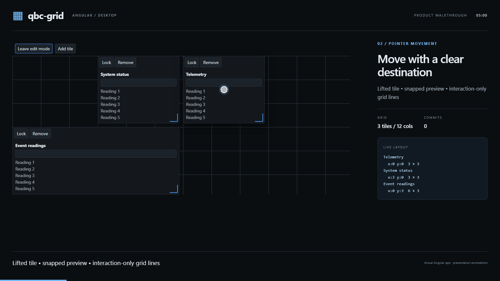

# qbc-grid

**A focused Angular grid for desktop dashboards.**

[](https://github.com/QuinntyneBrown/qbc-grid/actions/workflows/ci.yml)
[](LICENSE)
[](src/qbc-grid/package.json)

[Documentation](docs/README.md) · [Five-minute demo](docs/media/qbc-grid-demo.mp4) · [Contributing](CONTRIBUTING.md) · [Report an issue](https://github.com/QuinntyneBrown/qbc-grid/issues/new/choose)

qbc-grid arranges Angular content in a configurable, cell-based layout. Users can add,
move, resize, and lock tiles while the host application owns the widgets and layout
storage. It is designed for operator dashboards on large desktop screens, with a small
API and signal-based state.

## Demo

[](docs/media/qbc-grid-demo.mp4)

**[Watch or download the five-minute demo](docs/media/qbc-grid-demo.mp4)** — a narrated
walkthrough of the running Angular app, with on-screen explanations.
[Chapters, transcript, and recording instructions](docs/demo.md) are also available.

## Features

- **Cell-based layout.** Configure columns, row height, and gaps. The grid fills its
  container and grows downward while preserving the column count.
- **Pointer interactions.** Drag tiles with an elevated preview, a snapped destination
  shadow, and a grid overlay. Resize from the corner handle within per-tile limits.
- **Predictable placement.** Occupied destinations are refused. Other tiles keep their
  positions; the grid does not push, swap, or compact them.
- **Live and edit modes.** Enable layout editing explicitly, with independent locks on
  individual tiles. Projected controls continue to work in either mode.
- **Keyboard operation.** Move, resize, and jump to the nearest fitting position, with
  focus management, accessible names, and live-region announcements.
- **Plain layout data.** Receive committed changes, restore saved layouts, and add or
  remove tiles through the component API. Supplied layouts are repaired deterministically.
- **Your Angular content.** Supply the tile template and widgets. Moving a tile preserves
  its projected component instance, field value, and scroll state.
- **Design tokens.** Style the grid through the separate `@qbc/design-system` CSS token
  package, including reduced-motion preferences.

See the [product requirements](docs/specs/L1.md) and
[acceptance criteria](docs/specs/L2.md) for the complete behavior contract.

### Scope and compatibility

The library declares **Angular 21** peer dependencies. The acceptance suite currently
runs in desktop Chromium. Mobile, touch and pen input, breakpoint-based column
collapsing, nested grids, multi-selection, undo history, and drag auto-scroll are outside
the product scope. Persistence, routing, menus, and tile chrome belong to the host app.

The package manifest is version `0.1.0`. The instructions below build packages from this
repository; they do not depend on an npm registry release.

## Getting started

Use Node.js **22.12 or later in the 22.x line** and npm **11**, matching the CI toolchain
and Angular 21's [supported Node.js versions](https://angular.dev/reference/versions).

```sh
git clone https://github.com/QuinntyneBrown/qbc-grid.git
cd qbc-grid
npm install --global npm@11
npm ci
npm run tokens
npm start
```

Open **http://localhost:4200**. Select **Add tile**, then **Enter edit mode** to move or
resize it. This application saves layouts in browser local storage. For a small manual
development harness, run `npm run start:dev-app` instead.

### Install in another Angular application

Build and pack both the library and its design tokens from the repository root:

```sh
npm run build:lib
npm pack ./dist/qbc-grid
npm pack ./design-system
```

In your Angular 21 application, install the resulting archives, replacing the paths
with their locations on your machine:

```sh
npm install /path/to/qbc-grid-0.1.0.tgz /path/to/qbc-design-system-0.1.0.tgz
```

Import the authoritative token stylesheet in your application's global `styles.css`:

```css
@import '@qbc/design-system/qbc-tokens.css';
```

## Usage

Import the standalone component and template directive. Keep the layout in a signal and
accept changes through `layoutChange`.

**`dashboard.ts`**

```ts
import { ChangeDetectionStrategy, Component, signal } from '@angular/core';
import { GridComponent, GridTile, GridTileTemplateDirective } from 'qbc-grid';

@Component({
  selector: 'app-dashboard',
  imports: [GridComponent, GridTileTemplateDirective],
  templateUrl: './dashboard.html',
  styleUrl: './dashboard.css',
  changeDetection: ChangeDetectionStrategy.OnPush,
})
export class Dashboard {
  readonly layout = signal<readonly GridTile[]>([
    { id: 'telemetry', x: 0, y: 0, cols: 4, rows: 2, label: 'Telemetry' },
    { id: 'status', x: 4, y: 0, cols: 4, rows: 2, label: 'Status', locked: true },
  ]);
}
```

**`dashboard.html`**

```html
<qbc-grid
  [layout]="layout()"
  [columns]="12"
  [rowHeight]="60"
  [gap]="8"
  [mode]="'edit'"
  (layoutChange)="layout.set($event)"
>
  <div *qbcGridTile="let tile" class="widget">{{ tile.label ?? tile.id }}</div>
</qbc-grid>
```

**`dashboard.css`**

```css
.widget {
  padding: var(--qbc-space-3);
}
```

Coordinates are zero-based; spans are measured in whole cells. Omit `mode` for the
default `live` state. Replace the template content with your own Angular widgets.

See the [API and integration guide](docs/api.md) for inputs, outputs, constraints,
imperative methods, layout repair, and persistence integration.

### Keyboard controls

Focus an unlocked tile in edit mode, then use:

| Key           | Action                                                 |
| ------------- | ------------------------------------------------------ |
| Arrow keys    | Move one cell                                          |
| Shift + Arrow | Resize one cell                                        |
| Ctrl + Arrow  | Move to the nearest fitting position in that direction |
| Escape        | Cancel an active pointer move or resize                |

Keys used inside projected fields and controls remain owned by those controls.

## Documentation

| Resource                                                             | Contents                                                        |
| -------------------------------------------------------------------- | --------------------------------------------------------------- |
| [API and integration](docs/api.md)                                   | Public surface, examples, layout ownership, and repair behavior |
| [Demo guide](docs/demo.md)                                           | Video, chapter list, transcript, and reproducible recording     |
| [Design system](design-system/README.md)                             | Tokens, customization, gallery, and package build               |
| [Requirements](docs/specs/L1.md)                                     | Product scope and supported features                            |
| [Acceptance criteria](docs/specs/L2.md)                              | Given–When–Then behavior specifications                         |
| [Architecture and detailed designs](docs/detailed-designs/README.md) | Component boundaries and interaction diagrams                   |
| [Changelog](CHANGELOG.md)                                            | Changes being prepared for release                              |

## Development

```sh
npx playwright install chromium
npm run lint
npm test
npm run build
npm run build:tokens
npm run e2e
npm run verify:consumer
```

Acceptance tests drive `src/e2e-app` with a deterministic in-memory service. The packed
consumer check builds, installs, and runs the library in a separate Angular application.
See [CONTRIBUTING.md](CONTRIBUTING.md) for all checks and the development workflow.

## Contributing

Bug reports, documentation improvements, accessibility feedback, and focused pull
requests are welcome. Start with the [contribution guide](CONTRIBUTING.md) and follow
the [code of conduct](CODE_OF_CONDUCT.md). [Contributors](CONTRIBUTORS.md) and
[project governance](GOVERNANCE.md) describe who maintains the project and how changes
are reviewed.

## Support and security

For usage questions and reproducible bugs, see [SUPPORT.md](SUPPORT.md).
Report suspected vulnerabilities privately using [SECURITY.md](SECURITY.md).

## License

Copyright © 2026 Quinntyne Brown and qbc-grid contributors.
Licensed under the [MIT License](LICENSE).
