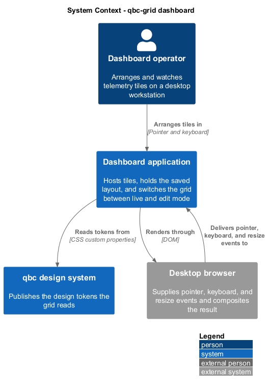
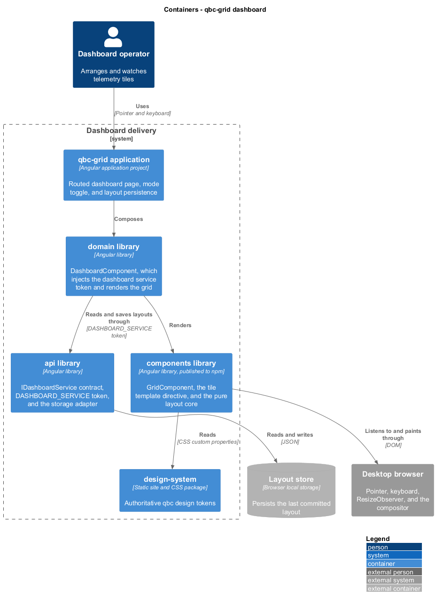

# qbc-grid detailed designs

## Overview

`qbc-grid` is an Angular component library that arranges dashboard tiles on a
cell-based grid and lets an operator move and resize those tiles with a pointer or
the keyboard. It targets Open MCT style operator dashboards on large desktop
screens, and its feature surface is deliberately small: the requirements in
`docs/specs/L1.md` name what the library does, and the "Out of Scope" section
there names what it deliberately does not.

Terms used across every design in this tree, defined once here:

- **cell** — one grid column wide by one row height tall
- **tile geometry** — the record `{ x, y, cols, rows }` locating a tile in whole
  cells from the origin at the top-left of the grid
- **shadow** — rectangle drawn at the cell geometry a tile would take if the
  interaction in progress were released
- **overlay** — cell structure painted behind the tiles for the duration of an
  interaction
- **commit** — adoption of a new geometry, followed by emission of the layout
- **revert** — restoration of the geometry a tile held before an interaction,
  with no emission

## Subsystems

| Subsystem | Concern | Features |
|-----------|---------|----------|
| [`grid-layout`](grid-layout/) | The cell model, the layout data contract, and its repair | 4 |
| [`tile-interaction`](tile-interaction/) | What the operator does to a tile, and what the grid shows in return | 6 |
| [`library-delivery`](library-delivery/) | How the grid fills a viewport, holds its frame budget, projects content, and ships | 4 |

## Where the C4 levels live

The system context and container views are identical for all 14 features: one
operator, one dashboard application, one component library, one browser. They are
held once here rather than repeated 14 times, and each feature carries the C4
**component** view scoped to its own slice, along with its class and sequence
diagrams.

### System context

The operator arranges tiles in the dashboard application. The application renders
through the browser, which returns pointer, keyboard, and resize events. The
design system supplies the tokens the grid reads for every visual value.

### Containers

The application project composes the `domain` library, which reaches the layout
store through the `DASHBOARD_SERVICE` token in the `api` library and renders the
grid from the `components` library. The `components` library is the published
deliverable and depends on nothing above it.

## Deliberate exclusions

`AGENTS.md` describes a .NET API, MediatR, and a `backend/` tree for this
repository. The requirements in `docs/specs/` name no server-side behaviour, so
this design introduces no backend. The layout is plain data that the grid emits;
the `api` library persists it through a browser storage adapter bound to the
`DASHBOARD_SERVICE` token, and a mock is bound in its place under Playwright. If a
shared or multi-user dashboard is later required, that adapter is the single seam
a .NET API would sit behind, and the grid itself would not change.

The design also excludes collision resolution during interaction, touch input,
nested grids, and breakpoint-driven column collapsing, each for the reason given
in `docs/specs/L1.md`.
