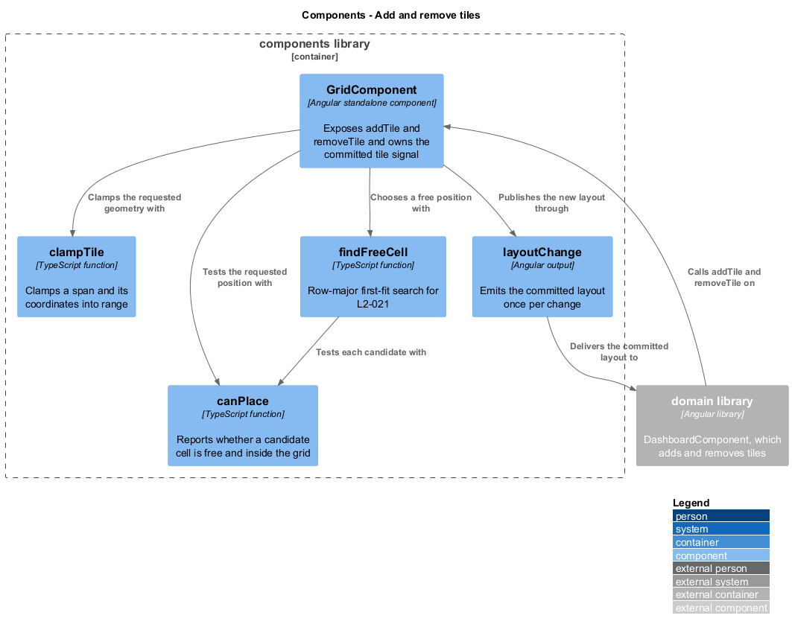
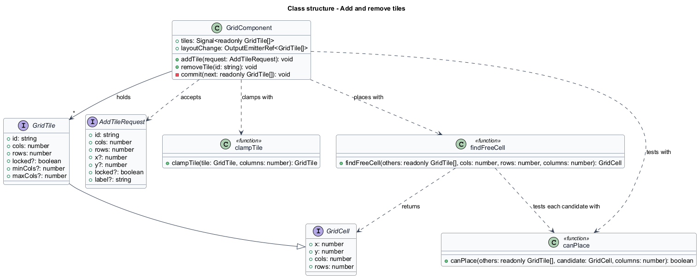
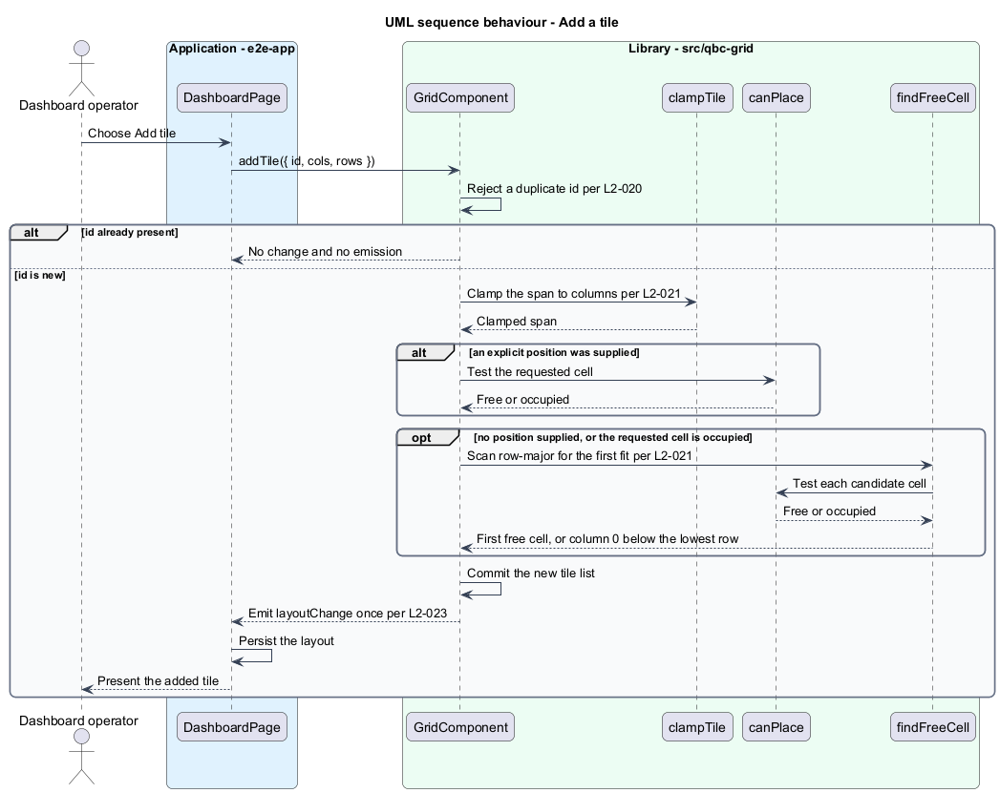
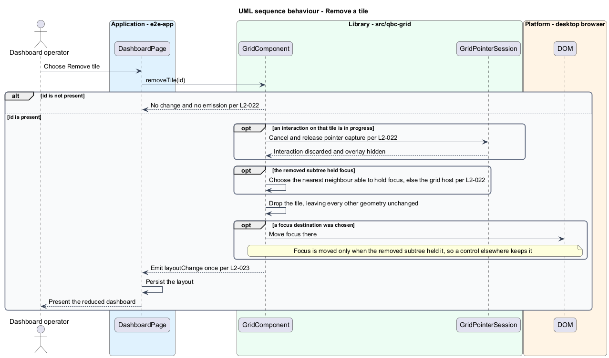

# Add and remove tiles

## Overview

A dashboard is not fixed at load. An operator adds a tile for a new telemetry source and
removes one that is no longer watched. This feature covers those two operations as the
host application invokes them, and the placement rule that keeps an added tile from
landing on top of an existing one.

Placement has two forms. With an explicit position the caller states where the tile
belongs; with no position the grid chooses. The choice is a **row-major first fit**: the
grid scans left to right along row 0, then row 1, and takes the first position where the
tile's span fits without overlapping. When no occupied row has room, the tile goes to
column 0 on the first row below the lowest occupied row.

First fit is chosen over a best-fit or bin-packing search because it is predictable. An
operator who adds three small tiles sees them fill the first gap in reading order, which
is where the eye already expects them. A cleverer search produces a tighter layout that
nobody can anticipate.

The grid never overlaps tiles, so an explicit position that is already occupied does not
produce an overlap and does not fail silently — it falls through to the same first-fit
search. A duplicate `id` is different: it is a caller error rather than a spatial
conflict, so the addition is rejected and the layout is left alone.

## Description

The feature adds two public methods to `GridComponent` and three pure functions beside
it in `src/qbc-grid/grid/`.

- **`GridComponent.addTile(request)`** — accepts an `AddTileRequest`, rejects a duplicate
  `id`, clamps the requested span, resolves a position, commits the new tile list, and
  emits `layoutChange` once.
- **`GridComponent.removeTile(id)`** — drops the tile with that `id`, cancels any
  interaction in progress on it, and emits `layoutChange` once. An unknown `id` changes
  nothing and emits nothing.

  Removing a tile also destroys whatever focus it held, and the control that removes it lives
  inside the tile, so a keyboard operator removing a tile is always removing the element they
  are standing on. Focus would fall to the document, and the next `Tab` would restart from
  the top of a dashboard of sixty tiles — the operator loses their place every time, and the
  arrangement that guarantees it is the grid rendering no chrome of its own. Focus therefore
  moves to the tile that followed in row-major order, to the one before it when the removed
  tile was last, and to the grid host when it was the only tile.

  Removing the tile a gesture is holding is the sharpest of the exits, because it is the only
  one where the element that took pointer capture leaves the document before the capture is
  given back. Releasing a capture on a detached element is the step a naive teardown gets
  wrong, and it throws where every other exit is silent. `L2-022` therefore asks for the
  three things that can be seen — the overlay gone, the shadow gone, and a different tile
  able to start its own drag — in place of asking that the interaction end cleanly, which
  was true of any behaviour at all.
- **`AddTileRequest`** — `id`, `cols`, and `rows` are required; `x`, `y`, `locked`, and
  `label` are optional. Omitting `x` and `y` selects automatic placement.
- **`clampTile`** — pure function reducing a span to at most `columns`, raising `cols`
  and `rows` to at least 1, and pulling `x` into `[0, columns - cols]`.
- **`canPlace`** — pure function reporting whether a candidate `GridCell` sits inside the
  grid and overlaps none of the supplied tiles. It is the single test used by placement,
  by the drag shadow, and by the keyboard commands, so all three agree by construction.
- **`findFreeCell`** — pure function performing the row-major scan. It advances past a
  blocker rather than through it: a candidate intersecting an occupant cannot fit at any
  row before that occupant ends, so the scan resumes at that occupant's bottom row. The
  first fit is unchanged and the work follows the records rather than the coordinates they
  carry, which is what keeps a tile declaring a billion rows from costing a billion tests.
  It calls `canPlace`
  for each candidate and terminates at the first row below the lowest occupied row,
  which bounds the search.

`GridComponent.commit` is the one private path through which the tile signal changes. It
sets the signal and emits `layoutChange`, so every mutation in the library — add, remove,
committed interaction, and repair — emits exactly once and in one place.

Both methods are imperative, so a host reaches them through a `viewChild` handle on the
grid rather than through a binding. That is the cost of the grid, not the host, owning
placement: `L2-021` puts the choice of a free cell inside the library, and a host that
appended to its own layout array would have to reimplement it. Adding through the grid and
persisting what the grid emits keeps one placement rule in one place.

## Requirements

The feature realizes the following level-2 (L2) requirements. Each L2 requirement
refines a level-1 (L1) requirement, cited by identifier.

| L2 ID | Refines (L1) | Requirement |
|-------|--------------|-------------|
| `L2-020` | `L1-007` | `addTile` shall insert a tile at the requested geometry after normalization, shall place it at the first free position when the requested cells are occupied, and shall reject an id that is already present. |
| `L2-021` | `L1-007` | `addTile` without `x` and `y` shall scan row-major from `(0, 0)` for the first position where the span fits, shall otherwise place the tile at column 0 on the first row below the lowest occupied row, and shall bound its search by the records present rather than by the coordinates they carry. |
| `L2-022` | `L1-007` | `removeTile` shall remove the tile with the given id, emit the layout, leave every other geometry unchanged, and treat an unknown id as a no-op, and shall place focus on the nearest neighbouring tile able to hold it, or on the grid host, when the removed subtree held focus and not otherwise. |

## Diagrams

The system context and container views are shared across every feature and are held at
the [tree root](../../README.md#where-the-c4-levels-live).

### Components

`GridComponent` exposes the two methods to the application and delegates every
spatial decision to `clampTile`, `canPlace`, and `findFreeCell`.

### Class structure

`AddTileRequest` is the caller-facing shape; `GridTile` is what the grid holds.
`findFreeCell` depends on `canPlace`, which is also the test used by the interaction
features.

### Behaviour — add a tile

A duplicate id ends the operation. Otherwise the span is clamped, an explicit position is
tested, and an occupied or absent position falls through to the row-major scan.

### Behaviour — remove a tile

An unknown id is a no-op. A known id cancels any interaction on that tile, drops it, and
emits the layout once.

