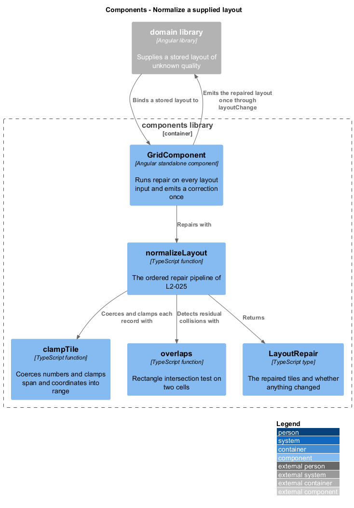
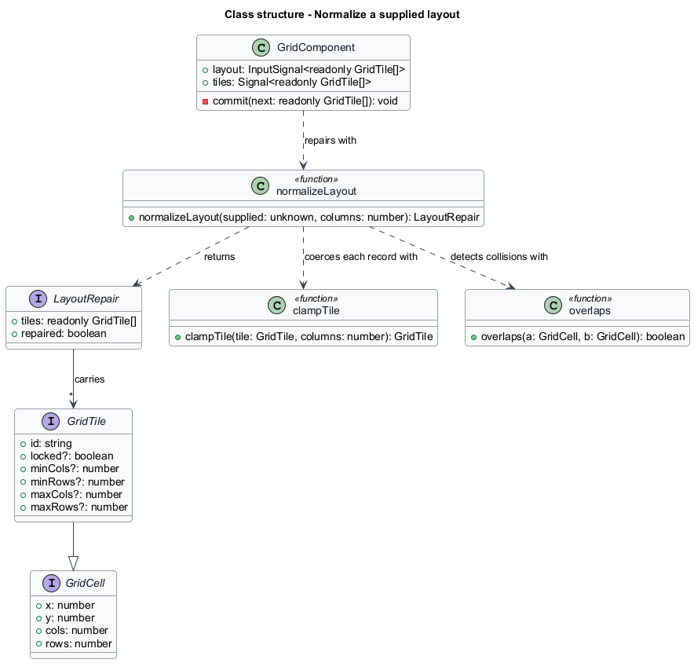
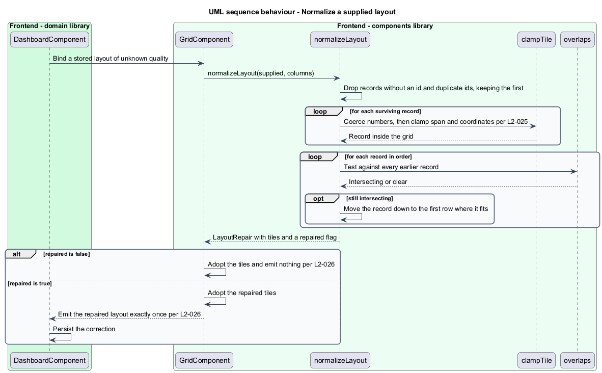

# Normalize a supplied layout

## Overview

A layout arriving at the grid is untrusted. It may have been saved months ago against a
16-column grid and restored into a 12-column one, hand-edited in storage, truncated by a
failed write, or supplied by a caller with a bug. A published library that throws on any
of these strands the operator on a blank dashboard with nothing to recover.

The design takes the opposite position: every supplied layout is **repaired** into a valid
state, deterministically, and the repair is reported so the host can persist the
correction. *Repair* is the one-time transformation that turns arbitrary input into a
layout satisfying the grid's invariants — unique ids, finite integer geometry, spans
inside the column count, and no overlaps.

Repair is not collision resolution. During an interaction the grid never pushes a tile out
of the way; a tile lands where it fits or it does not land. Repair happens once, on input,
before anything is rendered, and it is the only place a tile is moved without the operator
asking. The distinction keeps interaction predictable while still tolerating bad data.

Determinism is what makes repair safe to run on every input. The same input and the same
column count always produce the same output, so a repaired layout supplied back to the
grid is already clean and reports no further change. Without that property, a host that
saves on every emission would write in a loop forever.

## Description

The pipeline is one pure function in
`frontend/projects/components/src/lib/grid/normalize-layout.ts`, supported by two smaller
ones.

- **`normalizeLayout(supplied, columns)`** — returns a `LayoutRepair`. It applies four
  stages in a fixed order:
  1. **Identity.** Records without a string `id` are dropped. Where two records share an
     `id`, the first is kept and the rest are dropped, so the result is addressable.
  2. **Coercion.** Each remaining record's `x`, `y`, `cols`, and `rows` are floored;
     non-finite values become 0. `cols` and `rows` are raised to at least 1.
  3. **Bounds.** `cols` is reduced to at most `columns`, `x` is pulled into
     `[0, columns - cols]`, and `y` is raised to at least 0. Stages 2 and 3 are the work
     of `clampTile`.
  4. **Separation.** Records are walked in order. Any record still intersecting an earlier
     one is moved down to the first row where it fits. Walking in order makes the outcome
     depend on the input order alone, which is what makes it reproducible.
- **`LayoutRepair`** — `{ tiles, repaired }`. The `repaired` flag is set when any stage
  changed anything, and it is what `GridComponent` tests to decide whether to emit.
- **`clampTile`** — the per-record coercion and bounds clamp, shared with
  [`add-and-remove-tiles`](../add-and-remove-tiles/) so a supplied tile and an added tile
  are held to the same rules.
- **`overlaps`** — rectangle intersection on two `GridCell` values, the single collision
  test used by repair, by the drag shadow, and by the keyboard commands.

The separation stage is bounded: a record can be pushed at most as far as one row below
the lowest occupied row, so a layout of 500 records completes rather than searching
without limit.

`GridComponent` runs `normalizeLayout` on every change of the `layout` input, and routes
a repaired result through the same private `commit` method that every other change uses.
That is why a repair emits exactly once, like every other change.

## Requirements

The feature realizes the following level-2 (L2) requirements. Each L2 requirement
refines a level-1 (L1) requirement, cited by identifier.

| L2 ID | Refines (L1) | Requirement |
|-------|--------------|-------------|
| `L2-025` | `L1-009` | The grid shall normalize every supplied layout deterministically by dropping records without an id and records with a duplicate id, coercing numbers, clamping spans and coordinates into range, and moving a still-overlapping record down to the first row where it fits. |
| `L2-026` | `L1-009` | The grid shall emit the repaired layout exactly once when normalization changes a supplied layout, and shall emit nothing when it does not. |

## Diagrams

The system context and container views are shared across every feature and are held at
the [tree root](../../README.md#where-the-c4-levels-live).

### Components

`GridComponent` delegates the whole of repair to `normalizeLayout`, which composes
`clampTile` and `overlaps` and returns a `LayoutRepair`.

### Class structure

`normalizeLayout` accepts `unknown` rather than `GridTile[]`, because a stored layout has
no type guarantee at the boundary. `LayoutRepair` carries both the result and the fact of
the change.

### Behaviour — repair and report

Identity, coercion, bounds, and separation run in order. A clean layout is adopted
silently; a repaired one is emitted once so the host can persist the correction.

