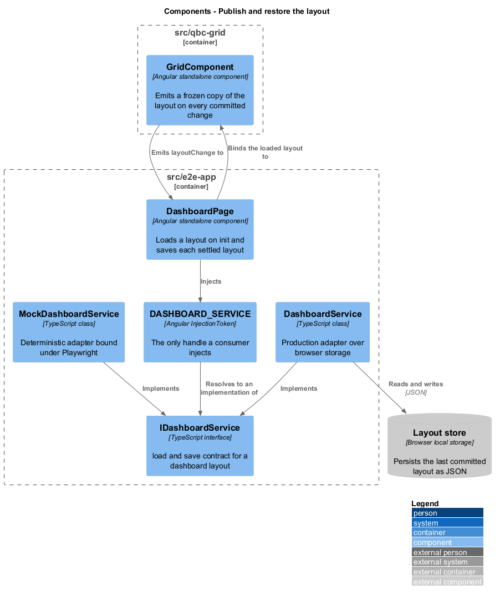
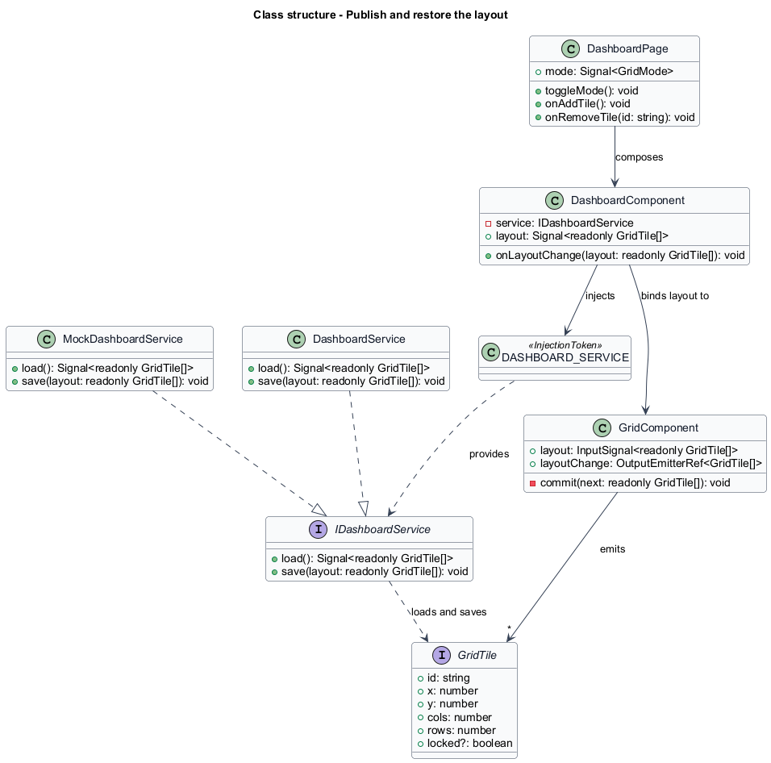
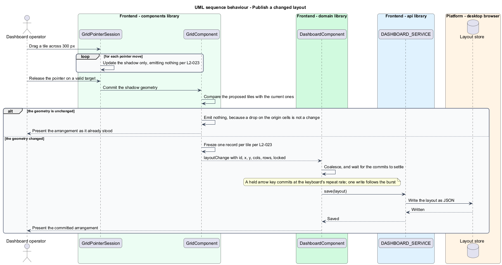
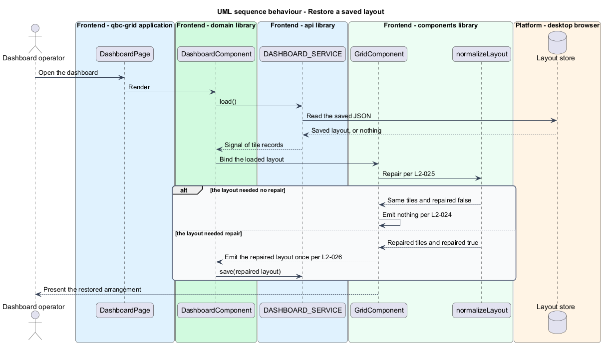

# Publish and restore the layout

## Overview

A dashboard arrangement outlives the session that made it. This feature is the contract
through which an arrangement leaves the grid and comes back: what the grid emits, when it
emits, and what guarantee the emitted data carries when it is supplied back.

The contract is plain data. A layout is an array of records holding `id`, `x`, `y`,
`cols`, `rows`, and `locked` — no class instances, no methods, nothing that survives
`JSON.stringify` badly. That is what lets a host persist a layout anywhere without
knowing anything about the grid.

An emitted record carries the whole tile, not only its geometry. Any `label`, `minCols`,
`minRows`, `maxCols`, and `maxRows` the host supplied are carried through unchanged, so a
save and restore does not quietly strip a tile's accessible name or its size limits. A
grid that emitted geometry alone would return a layout whose tiles announce themselves by
`id` and resize past the bounds their host set.

Timing matters as much as shape. The grid emits on **change**, not on **movement**. A
drag across 300 pixels of pointer travel produces one emission at release, not one per
pointer event — and a drag that wanders across the grid and returns to where it began
produces none at all, because nothing changed. Emitting per event would flood any
persistence the host attaches and would publish geometries the operator never chose, since
a drag passes over many cells on the way to the one it lands on.

The round trip carries one guarantee: a layout the grid emitted, supplied back to a grid
with the same configuration, renders identically and emits nothing. Emitting on restore
would mean the grid disagreed with data it had just produced, which would make a
save-on-emit host write forever in a loop. The one case where restore does emit is a
layout that needed repair, which is the subject of
[`normalize-supplied-layout`](../normalize-supplied-layout/).

## Description

The slice runs from the grid's output, through the application that hosts it, to the
storage behind its service token. Every part of it below the grid lives in `src/e2e-app`.

- **`GridComponent.layoutChange`** — Angular output carrying `GridTile[]`. It fires from
  the private `commit` method and from nowhere else, which is why the "exactly once per
  change" guarantee holds across add, remove, interaction, and repair alike.
- **`GridComponent.commit`** — the single emission gate. It compares the proposed tiles
  with the current ones and returns without emitting when every geometry is identical, so a
  drag that lands a tile back on the cells it started from is not a change and produces
  nothing. When something did change, it builds a fresh array of fresh records before
  emitting: handing out the grid's own array would let a host mutate the grid's state by
  accident, and a copy makes the emitted value inert.
- **`DashboardPage`** — the routed page in `src/e2e-app`, and the participant every
  sequence in this tree starts from. It owns the route, the `live` and `edit` toggle, the
  controls that add and remove a tile, and the layout itself: it injects `DASHBOARD_SERVICE`,
  binds what it loads into `qbc-grid`, and calls `save` when the layout settles. It holds
  that layout in a signal rather than an observable, since a layout is state rather than a
  stream. It is the demonstration host the acceptance tests drive.

  It is served at three routes that differ only in which token stylesheets the document
  carries, so that the criteria in
  [`theme-the-grid`](../../library-delivery/theme-the-grid/#the-three-token-configurations)
  can compare a themed render against an unthemed one.

  It also accepts `columns`, `rowHeight`, and `gap` on the URL and binds what it reads
  straight through to the grid. A parameter arrives as text and the input takes a number, so
  the page converts and does nothing else — no clamping, no guarding, no default. `Number`
  is the right conversion precisely because it keeps what the criteria depend on: `7.6` stays
  fractional, `-4` stays negative, and anything unparseable becomes `NaN` rather than
  something tidier. Five criteria fix
  those values and three of them fix values that are wrong on purpose — `columns` of 0,
  `columns` of 7.6, `gap` of -4 with `rowHeight` of `NaN` — to watch the grid coerce them.
  A page that repaired a bad value before the grid saw it would leave those criteria passing
  against the page's own arithmetic, testing the scaffolding and reporting on the library.
  Passing the raw value through is what keeps the coercion under test the grid's.

  It also carries the record of what the grid has emitted, described in
  [the testing seam](../../README.md#observing-what-the-dom-does-not-show): a count and the
  last payload, rendered into the page. Twenty-eight acceptance criteria turn on emission,
  and an Angular output leaves nothing in the DOM for a page object to read. The record
  lives here rather than in the library because a published grid has no business carrying
  instrumentation for its own tests, and because the saved layout cannot substitute — the
  coalescing described below means the number of saves and the number of emissions differ
  by design.
  Saving on settle rather than on every emission is the host's decision, not the library's.
  The grid emits once per committed change, which is the honest cadence for a change
  notification; a held arrow key repeats at the keyboard's rate, and writing storage
  synchronously thirty times a second would put the persistence of a demonstration app
  inside the frame budget the grid works to protect. The page therefore coalesces: a burst
  of commits produces one write once the burst stops.
- **`IDashboardService`** — the contract, declaring `load` and `save`, in the application
  that consumes it. It names no storage mechanism, so the page stays free of one. `load`
  returns a signal rather than a resolved array, which browser storage could supply
  synchronously; the signal shape is what lets a later server-backed adapter start empty and
  fill when the response arrives. Its `readonly GridTile[]` is what the contract intends, not
  what an adapter can prove: storage hands back parsed JSON, and
  [`normalize-supplied-layout`](../normalize-supplied-layout/) is where that difference is
  reconciled rather than assumed away. The grid needs no knowledge of that: a layout arriving
  late is an ordinary change of the `layout` input, and an empty layout on the way there
  needs no repair and emits nothing.
- **`DASHBOARD_SERVICE`** — the `InjectionToken` every consumer injects. The interface,
  the token, and each implementation live in separate files.
- **`DashboardService`** — the production adapter. It reads and writes the layout as JSON
  in browser storage, and converts the stored value to a signal at the boundary.
- **`MockDashboardService`** — the adapter bound under Playwright. It resolves a named
  layout from a `fixture` parameter on the URL and falls back to the ordinary dashboard when
  none is named, so an acceptance test never depends on stored state and never on the
  leftovers of the test before it.

  A name that is given and not recognised is a different matter, and it throws. Falling back
  there would run a specification against the ordinary dashboard while its own text said
  otherwise, and forty-two criteria turn on the arrangement being the one they describe. The
  kind ones would fail with a confusing message about the wrong layout; the dangerous ones
  would pass, because a criterion like *an empty grid places a 3-by-2 tile at column 0 row 0*
  is also true of several arrangements that are not empty. A typo in a fixture name is a
  defect in the specification, and it should read as one rather than as a defect in the
  grid.
- **`layout-fixtures.ts`** — the named layouts, declared once beside the mock. The
  acceptance criteria open by fixing a starting arrangement — an empty grid, a grid of
  three tiles, a first row occupied through column 5, a tile at column 9 of twelve, a
  locked tile spanning every column, sixty tiles of static content, five hundred records —
  and each of those arrangements is a fixture rather than a set-up written into a
  specification.

  The count of criteria that do so is left unstated because no reading of the phrase
  recovers it: six criteria name one of these arrangements outright and a hundred and
  fifteen open with an arrangement of some kind, so a number in between records a judgement
  rather than a fact, and drifts the moment a criterion is added. What the sentence carries
  is the rule, which stays true at any count.

  Naming them keeps the *given* independent of the behaviour under test. A specification
  that built its starting layout by clicking Add tile would depend on placement working
  before it could test anything else, so a defect in `findFreeCell` would fail dozens of
  unrelated specifications and hide which one had found it. A fixture puts the grid in a
  state directly, and a specification then exercises one behaviour and reports on one
  behaviour.

  A parameter rather than a route, unlike the token configurations. Those change the
  stylesheets the document carries, which settles before the first paint; a fixture changes
  only what the adapter returns when the page asks. Routing them would multiply three token
  routes by every fixture, for a distinction the browser never needs to make.

The binding happens at composition and nowhere else. `app.config.ts` provides
`DASHBOARD_SERVICE` with `DashboardService`; an `e2e` build configuration replaces that one
file with `app.config.e2e.ts`, which provides the same token with `MockDashboardService`,
and Playwright runs against that build. Two properties follow. A test cannot reach browser
storage even by accident, so specifications do not depend on each other's leftovers or on
the order they run in. And the production bundle never contains the mock, because the file
that names it is not part of that build.

The grid itself injects none of these. It takes a layout in and hands a layout out, which
is what keeps `GridComponent` publishable from `src/qbc-grid` with no application
dependency — and it is why there is no separate library between the page and the grid. A
component whose whole job was to sit on the far side of that boundary would be a file
justified by a folder rather than by a behaviour.

## Requirements

The feature realizes the following level-2 (L2) requirements. Each L2 requirement
refines a level-1 (L1) requirement, cited by identifier.

| L2 ID | Refines (L1) | Requirement |
|-------|--------------|-------------|
| `L2-023` | `L1-008` | The grid shall expose the layout as plain tile records, shall emit it only when a committed interaction, an add, a remove, or a repair changes it, and shall not emit during a drag or resize. |
| `L2-024` | `L1-008` | A layout emitted by the grid shall carry every tile property the host supplied, shall reproduce the same rendered geometry when supplied back to a grid with the same configuration, and shall emit nothing on load when no repair is needed. |

## Diagrams

The system context and container views are shared across every feature and are held at
the [tree root](../../README.md#where-the-c4-levels-live).

### Components

The grid emits into `DashboardPage`, which reaches storage only through the
`DASHBOARD_SERVICE` token. Two implementations satisfy the contract: the storage adapter
in production and a deterministic mock under Playwright.

### Class structure

`DashboardPage` depends on the token and the interface, never on a concrete adapter.
`GridComponent` depends on neither.

### Behaviour — publish a changed layout

Pointer moves change the shadow and emit nothing. Release commits once, freezes a copy,
and the host persists it.

### Behaviour — restore a saved layout

The loaded layout passes through repair. A clean layout emits nothing; a repaired one
emits once so the host can persist the correction.

