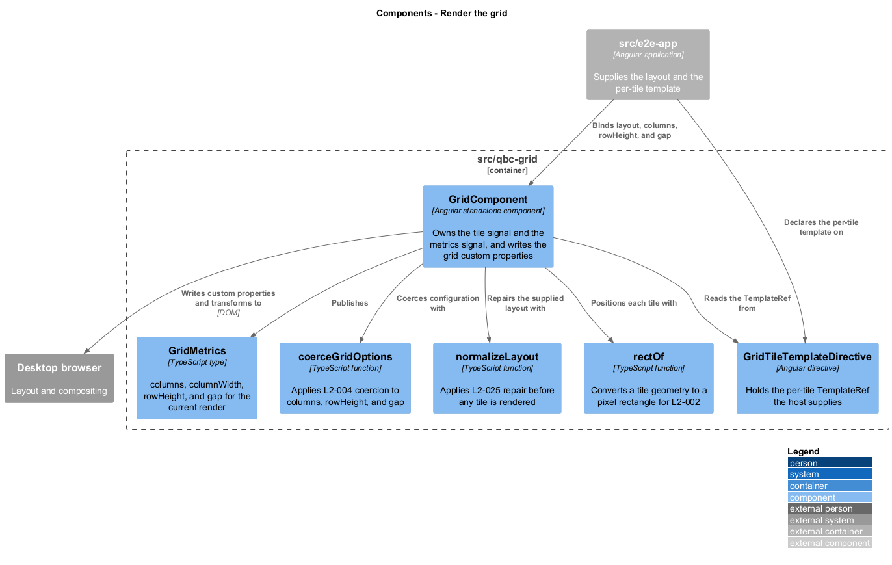
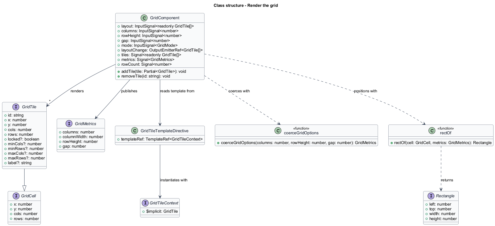
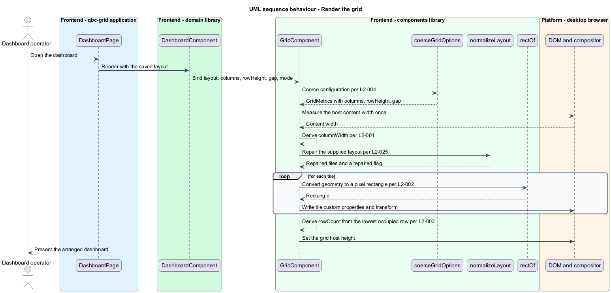

# Render the grid

## Overview

`qbc-grid` arranges dashboard tiles on a grid of equal-width columns. This feature is
the foundation the other thirteen rest on: it turns a list of tile records and four
configuration values into positioned elements on screen.

The grid is described in **cells**. A *cell* is one column wide by one row height tall.
A *tile geometry* is the record `{ x, y, cols, rows }` locating a tile in whole cells
from the origin at the top-left. Cells are a logical unit; pixels are derived. Column
width is not configured — it is computed from the width the host container gives the
grid, so the same layout fills a 1280 px panel and a 2560 px panel without any tile
record changing.

Rows behave differently from columns. The column count comes from configuration and is
never derived from the viewport, which is what makes a saved layout portable across
screens. A host may still configure a different count, and a layout restored into a
narrower grid is clamped to fit by
[`normalize-supplied-layout`](../normalize-supplied-layout/). Rows are unbounded: the grid
grows downward to whatever the lowest occupied tile needs.

Configuration reaching the grid is coerced rather than trusted, because the grid is a
published library and a caller can pass `0`, `-4`, or `NaN`. Coercion keeps a bad value
from producing a division by zero or an unrenderable grid.

## Description

The feature lives in the `components` library, at
`frontend/projects/components/src/lib/grid/`. One file holds one type, as the
repository requires.

- **`GridComponent`** — Angular standalone component with selector `qbc-grid`. It holds
  the signal inputs `layout`, `columns`, `rowHeight`, `gap`, and `mode`, and the output
  `layoutChange`. It exposes `tiles`, the computed signals `orderedTiles`, `metrics`, and
  `rowCount`, and the methods `addTile` and `removeTile`.
- **`GridComponent.tiles`** — a linked signal rather than a computed one, because it is
  read from two directions. Its source is the repaired `layout` input, so a new layout from
  the host replaces it wholesale; and `commit` writes it directly, so a drag, a keyboard
  command, an add, and a remove each change it without a round trip through the host. A
  computed signal cannot serve here at all — it is read-only, and every one of those five
  paths writes. Collaborators receive it as a plain `Signal`, so the write remains the
  component's alone.

  Naming the input `layout` and the output `layoutChange` also gives a host the option of
  `[(layout)]`. That loop terminates: the emitted layout is already repaired and already
  sorted, so feeding it back produces an identical value, `commit` finds nothing changed,
  and nothing is emitted a second time.
- **`GridTileTemplateDirective`** — directive with selector `[qbcGridTile]`. It captures
  the `TemplateRef` the host declares for a tile's content and hands it to
  `GridComponent`, which instantiates it once per tile with the tile as the implicit
  context.
- **`GridTile`** — the tile record: `id`, `x`, `y`, `cols`, `rows`, and the optional
  `locked`, `minCols`, `minRows`, `maxCols`, `maxRows`, and `label`.
- **`GridCell`** — the geometry `{ x, y, cols, rows }` without identity. Every placement
  rule in the library is written against `GridCell`, so a drag preview, a keyboard
  nudge, and a repair all share one vocabulary.
- **`GridMetrics`** — the derived render context: `columns`, `columnWidth`, `rowHeight`,
  and `gap`. It is recomputed when the container width changes and at no other time.
- **`coerceGridOptions`** — pure function applying `L2-004`. It floors `columns` to at
  least 1, raises `rowHeight` to at least 1, raises `gap` to at least 0, and substitutes
  the documented default for any non-finite value.
- **`rectOf`** — pure function converting a `GridCell` and a `GridMetrics` into the pixel
  `Rectangle` the tile occupies.
- **`GridComponent.orderedTiles`** — computed signal sorting `tiles` by `y`, then `x`,
  then `id`, and the only list the template iterates. Position comes from custom
  properties rather than document flow, so the sort has no visual effect; its whole purpose
  is that document order then matches reading order, which is what gives the tab order in
  `edit` mode its row-major sequence without a positive `tabindex`. `tiles()` keeps the
  normalized order and remains what the grid emits, so sorting for the screen never
  changes what a host stores. The loop is tracked by `id`, so a commit that changes the
  sort moves the existing elements rather than rebuilding them, and the projected views
  survive as [`project-tile-content`](../../library-delivery/project-tile-content/)
  requires.

`GridComponent` writes the metrics onto its host element as the custom properties
`--qbc-grid-columns`, `--qbc-grid-column-width`, `--qbc-grid-row-height`, and
`--qbc-grid-gap`, and writes each tile's geometry onto that tile's element as
`--qbc-tile-x`, `--qbc-tile-y`, `--qbc-tile-cols`, and `--qbc-tile-rows`. Both are written
as Angular style bindings on custom properties, which is enough for values that change
when a layout changes.

The split between those two groups is not cosmetic. The four tile properties carry
unitless numbers and the three grid properties carry lengths, because `calc()` multiplies a
number by a length and rejects a length by a length. Every rectangle follows from that one
rule:

```css
--tile-left:   calc(var(--qbc-tile-x) * (var(--qbc-grid-column-width) + var(--qbc-grid-gap)));
--tile-top:    calc(var(--qbc-tile-y) * (var(--qbc-grid-row-height)   + var(--qbc-grid-gap)));
width:         calc(var(--qbc-tile-cols) * var(--qbc-grid-column-width)
                    + (var(--qbc-tile-cols) - 1) * var(--qbc-grid-gap));
height:        calc(var(--qbc-tile-rows) * var(--qbc-grid-row-height)
                    + (var(--qbc-tile-rows) - 1) * var(--qbc-grid-gap));
transform:     translate3d(calc(var(--tile-left) + var(--qbc-drag-offset-x, 0px)),
                           calc(var(--tile-top)  + var(--qbc-drag-offset-y, 0px)), 0);
```

The two fallbacks in the last declaration are load-bearing. A resting tile has no drag
offset set, and a `var()` on an undefined property with no fallback makes the whole
declaration invalid at computed-value time — which would drop `transform` entirely and
stack every tile in the grid at the origin. The failure is total rather than local, and it
appears the moment a drag ends and the offsets are cleared, so `0px` is written as the
fallback rather than relied upon to be present. The two properties a drag moves every frame —
`--qbc-drag-offset-x` and `--qbc-drag-offset-y` — are the exception: they are set
imperatively on the one element being dragged, described in
[`hold-the-frame-budget`](../../library-delivery/hold-the-frame-budget/), so that a
gesture does not schedule change detection sixty times a second. Position is
then a `transform: translate3d(...)` built with `calc()` in the stylesheet, and size is
a `calc()` width and height. Keeping the arithmetic in CSS means a container resize
repositions every tile without the component touching a single element.

The grid host carries the computed height and does not clip: an absolutely positioned tile
sits inside a host whose height follows the lowest occupied row, with no `overflow` rule
hiding what extends past it. A tile moved to row 40 therefore lengthens the host and the
page scrolls to it, rather than disappearing behind a clipped edge.

Sub-pixel column widths are kept as fractions rather than rounded per tile. Rounding
each tile independently accumulates drift across a row and leaves the last tile short
of the container edge; deriving every edge from the unrounded `columnWidth` keeps the
final edge flush within one pixel.

## Requirements

The feature realizes the following level-2 (L2) requirements. Each L2 requirement
refines a level-1 (L1) requirement, cited by identifier.

| L2 ID | Refines (L1) | Requirement |
|-------|--------------|-------------|
| `L2-001` | `L1-001` | The grid shall render `columns` equal-width columns that fill the host container content width, deriving column width as `(containerWidth - gap * (columns - 1)) / columns`. |
| `L2-002` | `L1-001` | The grid shall place a tile with geometry `{ x, y, cols, rows }` at column `x` and row `y`, spanning `cols` columns and `rows` rows, separated from adjacent tiles by `gap` pixels on both axes. |
| `L2-003` | `L1-001` | The grid shall size its host to the lowest occupied row and shall impose no maximum row. |
| `L2-004` | `L1-001` | The grid shall coerce `columns` to `max(1, floor(columns))`, `rowHeight` to `max(1, rowHeight)`, and `gap` to `max(0, gap)`, and shall fall back to the documented default for a non-finite value. |

## Diagrams

The system context and container views are shared across every feature and are held at
the [tree root](../../README.md#where-the-c4-levels-live).

### Components

`GridComponent` coerces its configuration, repairs the supplied layout, publishes
`GridMetrics`, and positions each tile through `rectOf`. The per-tile template comes
from `GridTileTemplateDirective`, declared by the host.



### Class structure

`GridTile` extends `GridCell` with identity and constraints. `GridComponent` renders
many tiles against one `GridMetrics`, and depends on the two pure functions rather than
holding the arithmetic itself.



### Behaviour — render a supplied layout

The container width is measured once, `columnWidth` is derived from it, the layout is
repaired, and each tile's geometry is written as custom properties. The grid host height
follows the lowest occupied row.


