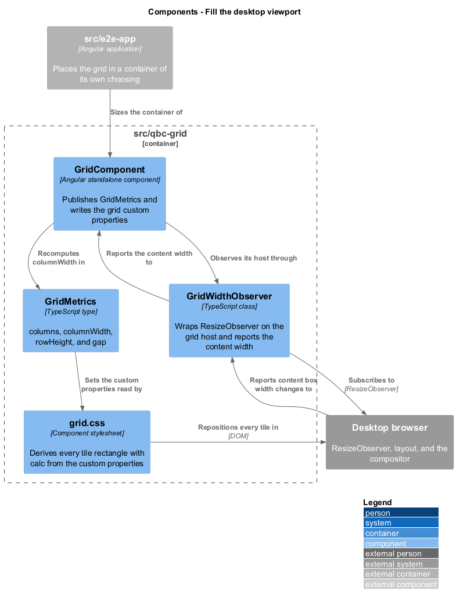
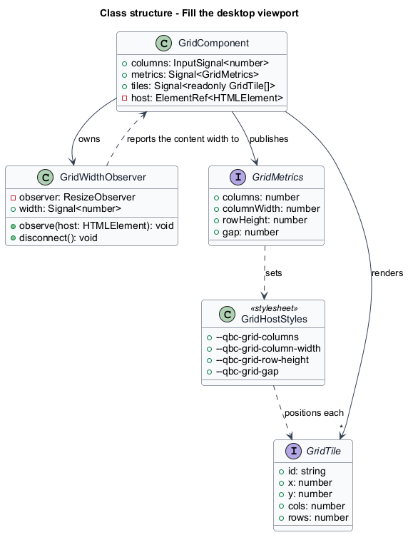
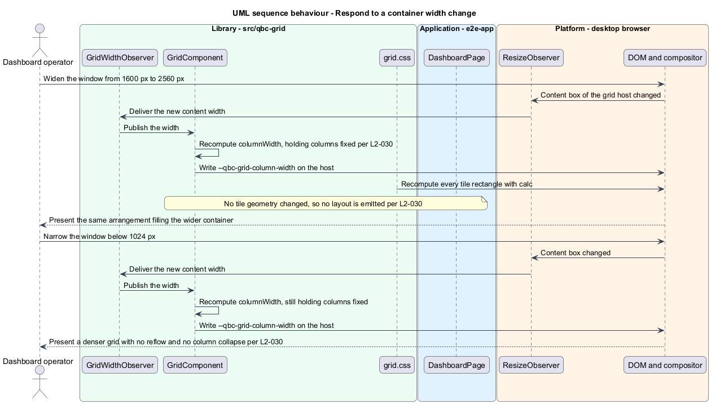

# Fill the desktop viewport

## Overview

`qbc-grid` is built for one class of screen: the large desktop display an operator sits in
front of for a shift. The supported range is 1024 px to 2560 px of container width, and
across the whole of it the grid does one thing — it fills its container and keeps the same
number of columns.

Holding the column count fixed is what makes a saved layout portable. A tile stored at
column 4 spanning 3 columns is at column 4 spanning 3 columns on every screen; only the
pixel width of a column changes. The moment a grid collapses to fewer columns at a
breakpoint, a saved layout means something different on each machine, and an operator's
arrangement stops being theirs.

That is why there are no breakpoints here, and why "responsive" means one thing only:
proportional. Below 1024 px the grid does not reflow, collapse, or switch to a single
column. It becomes denser, and it is out of support. Above 2560 px it keeps filling.
A dashboard aimed at a phone is a different product, and building for both would double the
interaction rules for a case the requirements exclude.

A container resize is presentation, not a decision. The operator did not rearrange
anything, so no tile geometry changes and no layout is emitted. A grid that emitted on
every resize would have a save-on-emit host writing storage all the way through a window
drag.

## Description

Width reaches the grid through one observer and leaves it as one custom property.

- **`GridWidthObserver`** — wraps a `ResizeObserver` on the grid host and exposes the
  observed content width as a signal. It observes the **content box**, so host padding does
  not leak into the column arithmetic, and it disconnects when the component is destroyed.
  Observing the host rather than the window is what lets the grid sit in a split pane, a
  drawer, or a panel and still be correct.
- **`GridComponent.metrics`** — computed from the observed width and the coerced
  configuration. `columnWidth` is
  `(width - gap * (columns - 1)) / columns`, kept as a fraction rather than rounded, so the
  last tile's right edge stays flush with the container instead of drifting short.
- **The grid custom properties** — `--qbc-grid-columns`, `--qbc-grid-column-width`,
  `--qbc-grid-row-height`, and `--qbc-grid-gap`, written on the host element when the
  metrics change. This is the whole of the component's response to a resize: one write on
  one element.
- **`grid.css`** — derives every tile rectangle from those properties with `calc()`, so a
  resize repositions 60 tiles without the component touching a single tile element. Pushing
  the arithmetic into CSS is what keeps the resize path independent of the tile count.

Tile records are untouched by a resize. `GridComponent.tiles` does not change, `commit` is
not called, and `layoutChange` does not fire.

Four criteria state a container width and expect a column width to follow from it. The
demonstration page therefore gives the grid the full width of the viewport, with no padding,
no margin, and no chrome beside it, so a Playwright viewport set to the width a criterion
names gives the grid a container of exactly that width, and the criterion's arithmetic is the
grid's arithmetic. The width itself is not repeated here. A worked
example copied into the design is a value with two homes, and the copy is the one that goes
stale. The library
supports a host that pads its container — that is why
[`reveal-the-grid`](../../tile-interaction/reveal-the-grid/) sets the overlay's background
origin to the content box — and the demonstration page declines to, so a test never has to
subtract anything to know what it measured.

The observation cannot feed itself. What the observer reports is width; what the grid writes
back is `--qbc-grid-column-width`, which moves tile edges horizontally. The grid's height
comes from `rowCount`, which is derived from tile geometry alone and never from width, so a
width change cannot change the height, cannot add or remove a page scrollbar, and cannot
return as a second width change. That is what keeps the observer from oscillating, and it is
a property of the arithmetic rather than a guard bolted on top of it.

## Requirements

The feature realizes the following level-2 (L2) requirement. It refines a level-1 (L1)
requirement, cited by identifier.

| L2 ID | Refines (L1) | Requirement |
|-------|--------------|-------------|
| `L2-030` | `L1-011` | The grid shall keep the same column count and fill its container from 1024 px to 2560 px of container width, shall not emit a layout when the container width changes, and shall not collapse or reflow at any width. |

## Diagrams

The system context and container views are shared across every feature and are held at
the [tree root](../../README.md#where-the-c4-levels-live).

### Components

`GridWidthObserver` reports the content width, `GridComponent` recomputes one number, and
the stylesheet repositions every tile from the resulting custom property.

### Class structure

The observer holds the width as a signal; `GridMetrics` holds the derived geometry; the
stylesheet consumes it. No tile record participates.

### Behaviour — respond to a container width change

Widening and narrowing follow the same path: recompute `columnWidth`, write one property,
change no geometry, and emit nothing.

