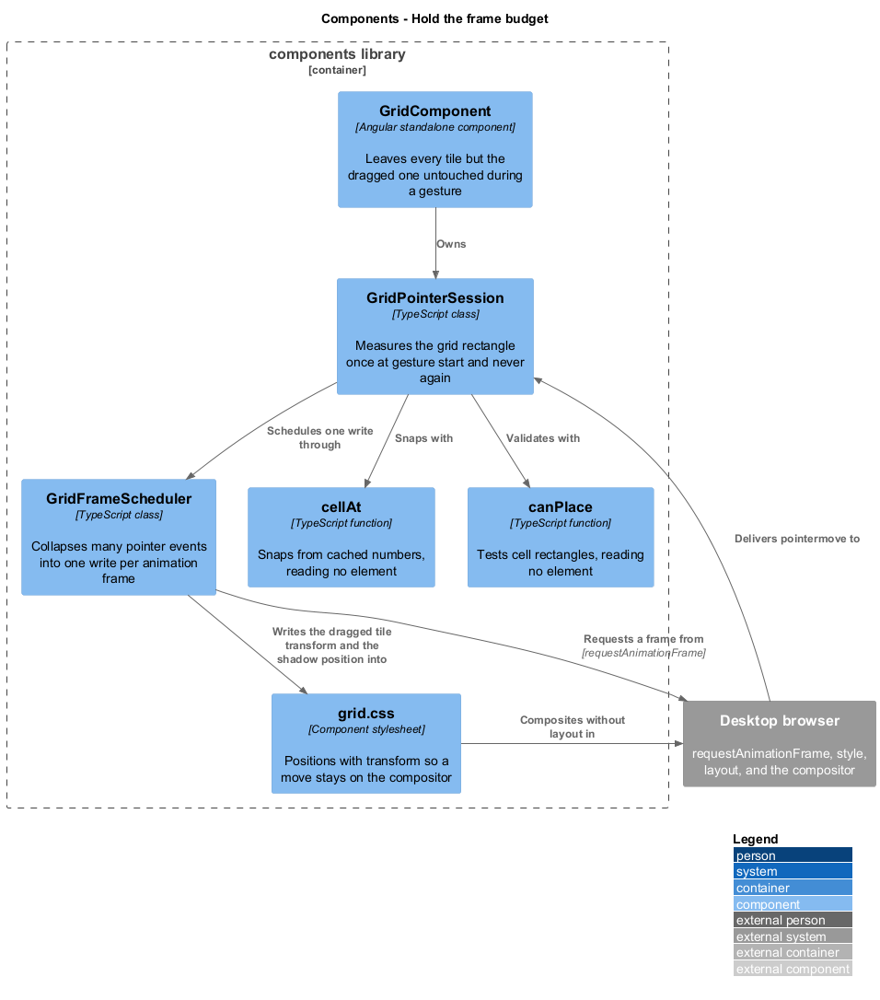
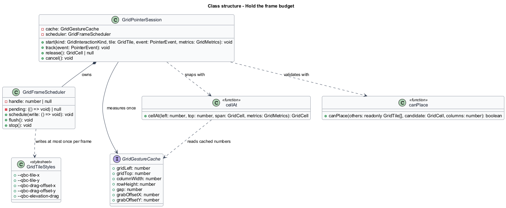
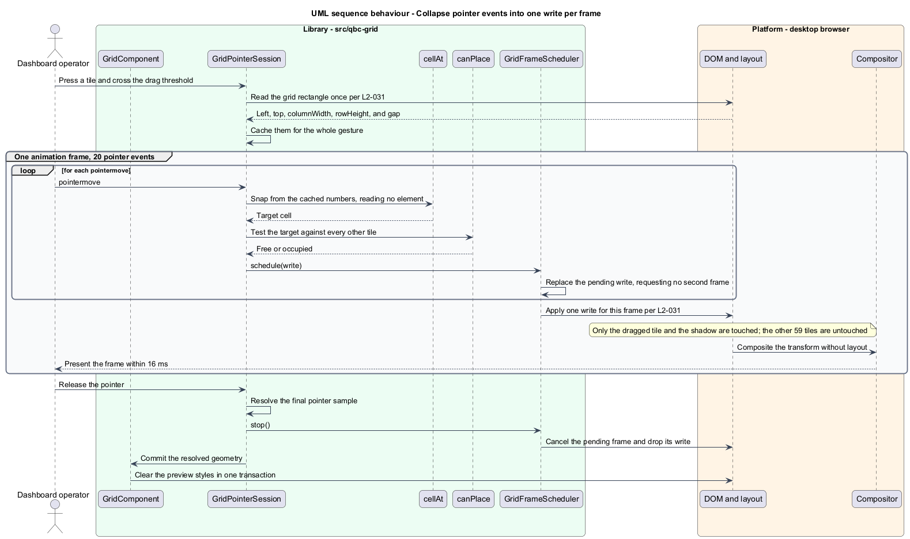

# Hold the frame budget

## Overview

A drag is judged entirely on whether it feels attached to the hand. At 60 frames per
second a frame lasts about 16 ms, and a dashboard carrying 60 tiles gives the grid no
slack to waste. This feature is the set of decisions that keep a drag inside that budget,
and the reason none of the other interaction features have to think about it.

Three costs threaten a drag loop, and each is removed rather than reduced.

**Reading the DOM during the gesture.** Asking an element for its position mid-gesture
forces the browser to compute layout before it can answer. Every geometric value the drag
needs is therefore measured once, when the gesture starts, and cached for its duration.
Nothing in the loop reads an element.

**Writing more often than the screen updates.** A browser can deliver many pointer events
between two frames, and acting on each one does work no eye will ever see. Writes are
therefore scheduled rather than applied: many events in one frame collapse into the single
write that frame will paint.

**Writing properties that force layout.** Position is applied as a `transform`, which the
compositor can apply without recomputing layout. A resize changes width and height, which
does cost layout, but on exactly one element.

The fourth decision is what is *not* touched. During a drag only the dragged tile and the
shadow have their styles mutated. The other 59 tiles are inert, so the cost of a drag does
not grow with the size of the dashboard.

## Description

The budget is held by one small class and one cached record, used by every gesture.

- **`GridFrameScheduler`** — holds at most one pending write and one outstanding
  `requestAnimationFrame` handle. `schedule(write)` replaces the pending write and requests
  a frame only when none is outstanding, so 20 pointer events in one frame produce one
  write, not 20. `flush` applies a pending write immediately, which release uses so the
  committed geometry is not delayed by a frame. `stop` cancels the outstanding handle,
  which cancellation and destruction both use so no write outlives the gesture.
- **`GridGestureCache`** — the values measured once at gesture start: the grid's left and
  top in client coordinates, the column width, the row height, the gap, and the offset
  between the pointer and the tile's top-left corner. `GridPointerSession` holds one for the
  life of a gesture.
- **`cellAt`** and **`canPlace`** — pure functions over numbers and cell rectangles. Neither
  touches an element, which is what makes the per-event work a few arithmetic operations
  and an overlap scan rather than a layout pass.
- **The drag offset properties** — `--qbc-drag-offset-x` and `--qbc-drag-offset-y` on the
  dragged tile. The stylesheet composes them with the tile's cell position inside a single
  `transform: translate3d(...)`, so the per-frame write is two custom property assignments
  on one element.
- **`--qbc-elevation-drag`** — applied through a class on the dragged tile at gesture start
  and removed at its end, rather than per frame, so the lift costs one style change for the
  whole gesture. The same class carries `will-change: transform`, and the timing is the
  reason it is worth naming. Promoting the tile to its own compositor layer is what keeps
  the per-frame transform off the main thread, but a promotion costs memory and a paint, so
  a grid that declared it on every tile would hold sixty layers to move one. Declaring it
  only for the tile under the pointer, for only as long as the gesture lasts, is what buys
  the compositing without the standing cost. `L2-010` binds the release as well as the
  taking, because a promotion that is never dropped costs exactly what scoping it was
  meant to save and passes every criterion that only looks at a drag in flight.

The overlap scan in `canPlace` is linear in the tile count, which at 60 tiles is far below
the cost of a single layout pass. It is left simple rather than indexed, because the
measured budget holds without an index and a spatial index would be code the requirements
do not need.

The budget `L2-031` sets is a budget for the grid, and the criterion says so by fixing what
the tiles hold: static content that neither animates nor updates. Without that condition the
measurement would answer a different question every time it ran — sixty empty elements pass
it trivially, and sixty live telemetry widgets fail it while the grid does nothing wrong.
A number that moves with an unstated variable measures the variable.

What the grid can promise is therefore bounded, and the bound is worth stating plainly. It
touches two elements per frame however many tiles exist, and it leaves the resting tiles
alone. It cannot make room for a host that re-renders sixty widgets on every telemetry tick;
that work lands in the same frames, and no amount of care inside the grid recovers it. The
projection seam is what leaves that cost where it can be fixed — in the host's components,
which own their own change detection — rather than burying it inside a library that has no
view of it.

## Requirements

The feature realizes the following level-2 (L2) requirement. It refines a level-1 (L1)
requirement, cited by identifier.

| L2 ID | Refines (L1) | Requirement |
|-------|--------------|-------------|
| `L2-031` | `L1-012` | The grid shall apply position and size through compositor-friendly style writes batched to at most one write per animation frame per moved element, shall measure gesture geometry once at gesture start, and shall hold the 95th percentile frame duration at or below 16 ms while one tile among 60 is dragged. |

## Diagrams

The system context and container views are shared across every feature and are held at
the [tree root](../../README.md#where-the-c4-levels-live).

### Components

The session measures once and computes from cached numbers; the scheduler decides when the
result reaches the DOM; the stylesheet keeps a move on the compositor.

### Class structure

`GridFrameScheduler` holds one pending write and one frame handle. `GridGestureCache` holds
everything the loop would otherwise have to measure.

### Behaviour — collapse pointer events into one write per frame

Twenty pointer events in one frame produce one write, on one element, composited without
layout.

