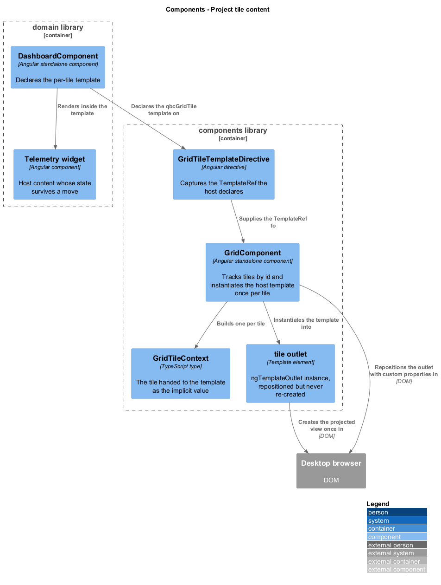
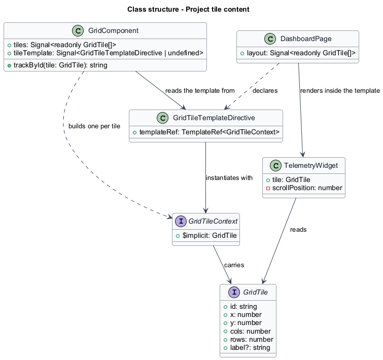
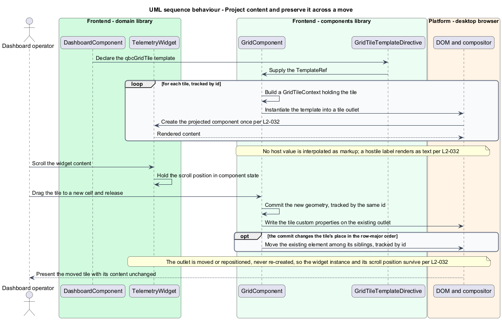

# Project tile content

## Overview

The grid arranges tiles; it knows nothing about what is inside them. A tile might hold a
strip chart, a table of limits, or a camera feed, and the library has no opinion on any of
it. This feature is the seam through which host content reaches a tile, and the two
guarantees that seam carries.

The first guarantee is about safety. Content reaches a tile through an Angular template the
host declares — never as a string the grid renders as markup. The library uses no
`innerHTML`, no `insertAdjacentHTML`, and no `bypassSecurityTrust` call, so there is no
path by which a stored label, a tile id, or any other host value can become executable
markup. A layout restored from storage is data of unknown provenance; treating any of it as
HTML would make a dashboard's saved state an injection vector.

The second guarantee is about identity. A tile's projected view is created once and is
**repositioned**, not re-created, when the tile moves or resizes. A widget with a scroll
position, an open menu, a paused animation, or a live subscription keeps all of it across a
drag. Tearing the view down and rebuilding it would reset every one of them and, on a
dashboard of telemetry components, would make rearranging tiles expensive as well as
disruptive.

Both guarantees come from the same decision: the grid owns the tile elements and the host
owns their contents, connected by a template rather than by a string or a component
reference.

## Description

Projection is one directive, one context type, and a tracked loop.

- **`GridTileTemplateDirective`** — selector `[qbcGridTile]`, declared by the host on an
  `ng-template` inside `qbc-grid`. It captures the `TemplateRef` and exposes it;
  `GridComponent` reads it as a signal content query. An `ng-template` renders nothing of
  itself, so the directive is found as declared content whether or not the grid projects it
  through `<ng-content>` — and the grid does not, because it instantiates the template once
  per tile rather than once. The host writes the template once.

  The query is typed as possibly absent, because a host may declare the template inside a
  `@if` or omit it entirely. With no template the grid renders its tile elements and leaves
  them empty: the geometry, the overlay, and every interaction still work, and the tiles are
  blank surfaces. Failing loudly would punish a host mid-way through wiring the grid up, and
  a blank tile says what is wrong without one.
- **`GridTileContext`** — `{ $implicit: GridTile }`. The tile is the implicit value, so the
  host's template reads `let-tile` and gets the record, including any `label` and the
  current geometry.
- **The tile outlet** — each tile element instantiates the template through
  `ngTemplateOutlet`. Changing the context updates the existing embedded view rather than
  replacing it, which is the mechanism behind the identity guarantee.
- **`GridComponent.trackById`** — the loop over tiles is tracked by `id`. Geometry changes
  produce new tile records, and without tracking by a stable key Angular would treat a moved
  tile as a new one and destroy the projected view. Tracking by `id` is what keeps the view
  alive.
- **Positioning by custom property** — a move writes `--qbc-tile-x` and `--qbc-tile-y` on
  the existing tile element. For the whole of a gesture no element is created, destroyed, or
  moved among its siblings, and the only element that changes is the one under the pointer:
  its transform during a move, its width and height during a resize. This is the same
  mechanism [`hold-the-frame-budget`](../hold-the-frame-budget/) relies on for speed; here
  it buys correctness as well.
- **Reordering on commit** — a committed move can change a tile's place in the row-major
  order the template iterates, and Angular then moves that element among its siblings.
  Because the loop is tracked by `id`, the element and its embedded view are moved rather
  than destroyed and rebuilt, so the projected component instance and every piece of its
  state survive, which is what this requirement asks for.

  A DOM move does briefly detach the node, and Angular's view identity is not the browser's.
  An embedded view can be moved intact while the browser resets what it holds: focus goes to
  the document, an `iframe` reloads, playing media restarts. A wrapper inside the tile does
  not help, because the wrapper is inside the subtree that moved; only a node that is not
  moved keeps its connection, and the tile is the thing being moved.

  So the requirement is met for what a component owns — instance identity, scroll position,
  the value and focus of a field — and the design carries that and no more. Focus is
  captured before a commit that reorders and restored after it, and only when the reorder
  is what took it, so a move never pulls focus back from somewhere the operator sent it.
  Native content that reloads on detachment is outside what this design promises: keeping
  it would need a state-preserving DOM move, and whether one is available is a property of
  the renderer and the browser rather than of this component. A criterion counting
  constructor calls would report success in every one of these cases, so the acceptance
  reads the scroll position and the active element instead.

Host values that do reach the DOM — the accessible name and the tile id — travel through
Angular property and attribute bindings, which escape their input. A `label` of
`` renders as that text.

An instance surviving a move is invisible from outside the application, so the widget the
demonstration page projects carries its own evidence. It renders `data-qbc-widget-instance`,
a value taken from a counter in its constructor, and a scroll position it holds in component
state and reflects into the DOM. A move that rebuilt the view would allocate a new instance
value and lose the scroll; a move that relocated it leaves both untouched. The requirement is
about identity, and identity is what the attribute carries.

Proving that a hostile label ran nothing needs no instrumentation at all. If the string had
been parsed as markup the tile would hold an `img` element and its text would differ from the
string supplied, so a specification asserts the text matches character for character and that
the tile contains no element the fixture did not project. An assertion that watched for an
alert would prove only that one payload failed.

## Requirements

The feature realizes the following level-2 (L2) requirement. It refines a level-1 (L1)
requirement, cited by identifier.

| L2 ID | Refines (L1) | Requirement |
|-------|--------------|-------------|
| `L2-032` | `L1-013` | The grid shall accept tile content through Angular content projection, shall not use `innerHTML`, `outerHTML`, `insertAdjacentHTML`, or any `bypassSecurityTrust` call, and shall preserve the projected view across a move or resize. |

## Diagrams

The system context and container views are shared across every feature and are held at
the [tree root](../../README.md#where-the-c4-levels-live).

### Components

The host declares one template; the grid instantiates it once per tile into an outlet it
then repositions. No string crosses the boundary.

### Class structure

`GridTileContext` carries the tile as the implicit value. `GridComponent` holds the
directive's `TemplateRef` and tracks tiles by `id`.

### Behaviour — project content and preserve it across a move

The projected component is created once. A committed move writes custom properties on the
existing outlet, and moves that element among its siblings when the row-major order
changes; tracking by `id` means the view is moved rather than rebuilt, so widget state
survives either way.

