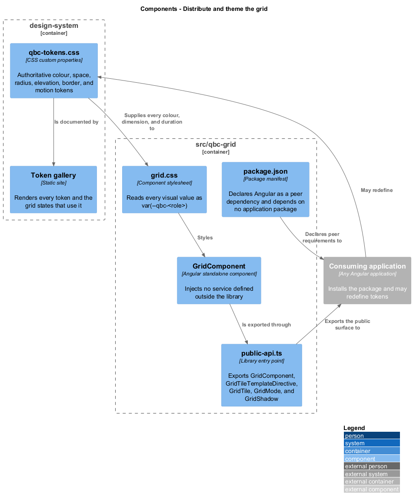
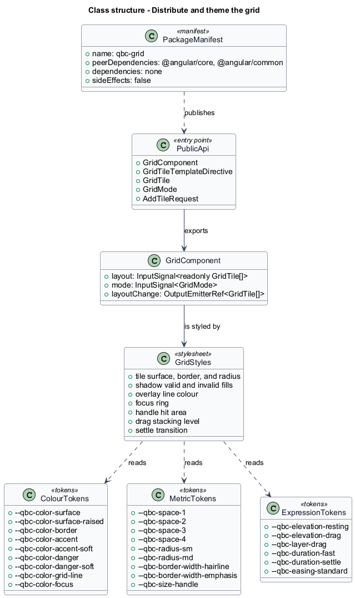
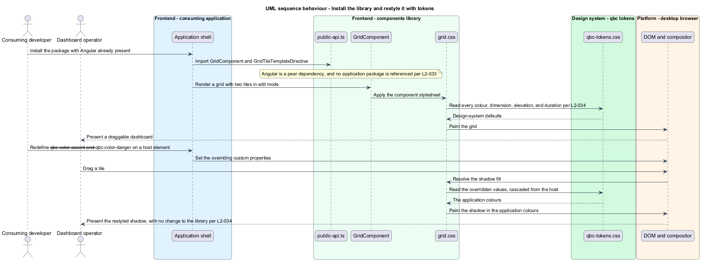

# Distribute and theme the grid

## Overview

`qbc-grid` is meant to be installed by applications that have nothing to do with this
repository. That ambition sets two constraints, and this feature is both of them.

The first is **dependency direction**. The grid lives in the `components` library, whose
place in the workspace is the leaf: it imports nothing from the application, nothing from
the `api` or `domain` libraries, and injects no service defined outside itself. Angular is
a peer dependency rather than a dependency, so a consumer's Angular is the only Angular in
the tree. A component that discovers it needs a service does not gain one here — it moves
to `domain`, and stays out of the published package.

The second is **restyling without forking**. Every colour, dimension, radius, elevation,
border width, and transition duration in the grid's stylesheets is read as a
`var(--qbc-<role>)` custom property. A consumer who wants the drop shadow in their own
accent colour redefines one token on a host element and the cascade does the rest. A
hard-coded hex or pixel value in a component stylesheet is a defect, because it is a value
no consumer can reach.

The design system owns those tokens, and it is a deliverable rather than a folder. It sits
at `design-system/`, beside `backend/` and `frontend/`, with its own package, its own
tests, and its own static site, and it carries no runtime dependency on the application.
Its copy of the tokens is authoritative; the front end mirrors them. When the grid needs a
value that has no token, the token is added to the design system first.

## Description

The slice is a package shape, an entry point, and a token catalogue.

- **`public-api.ts`** — the library's entry point, exporting `GridComponent`,
  `GridTileTemplateDirective`, and the three types a consumer binds against: `GridTile`,
  `GridMode`, and `AddTileRequest`. Nothing else is exported. `GridShadow`,
  `GridInteraction`, `GridMetrics`, and the pure layout functions are internal, because no
  consumer needs to name them to render a grid, add a tile, or read a layout — and every
  exported name is one the library then owes stability to.

  The observation attributes in [the testing seam](../../README.md#the-testing-seam) are not
  exports either. They are markup the grid emits, held stable for this repository's page
  objects and named by nothing a consumer writes, so the count of five stands.
- **`package.json`** — declares `@angular/core` and `@angular/common` as peer dependencies,
  no runtime dependencies, and `sideEffects: false`. It references no package from this
  workspace.
- **`qbc-tokens.css`** — the authoritative token file in `design-system/`, in three groups:
  - **Colour** — `--qbc-color-surface`, `--qbc-color-surface-raised`, `--qbc-color-border`,
    `--qbc-color-accent`, `--qbc-color-accent-soft`, `--qbc-color-danger`,
    `--qbc-color-danger-soft`, `--qbc-color-grid-line`, `--qbc-color-focus`. One of these
    carries a constraint beyond taste: `--qbc-color-grid-line` is expected to be opaque,
    because the overlay paints its columns and rows as two gradient layers that composite
    where they cross, and a translucent value would darken every intersection. The token is
    a consumer's to change; a consumer changing it to a translucent colour gets a stippled
    overlay, and [`reveal-the-grid`](../../tile-interaction/reveal-the-grid/) says why.
  - **Metric** — the four-step spacing scale `--qbc-space-1` through `--qbc-space-4`,
    `--qbc-radius-sm`, `--qbc-radius-md`, `--qbc-border-width-hairline`,
    `--qbc-border-width-emphasis`, and `--qbc-size-handle`, the resize handle's hit area.
    The scale belongs to the design system rather than to the grid, and the grid spends one
    step of it: `--qbc-space-1` sets the resize handle's inset from the tile corner and the
    focus ring's offset from the tile edge. The remaining steps serve other consumers, and
    the grid imposes no padding of its own on projected content.
  - **Expression** — `--qbc-elevation-resting`, `--qbc-elevation-drag`,
    `--qbc-layer-drag`, `--qbc-duration-fast`, `--qbc-duration-settle`, and
    `--qbc-easing-standard`. `--qbc-layer-drag` is the stacking level a tile takes while it
    is dragged; a consumer whose application has its own stacking scale redefines it rather
    than fighting a literal in the library.
- **`grid.css`** — reads those tokens for the tile surface and border, the valid and
  invalid shadow fills, the overlay line, the focus ring and its offset, the handle hit area
  and inset, the drag stacking level, and the settle transition. Every token is read with a
  fallback to the design system's default, so a consumer who has not loaded the token file
  still gets a legible grid rather than an unpainted one.

  The fallback is the one place a literal value appears in the grid's stylesheets, and it
  is deliberate. `L2-034` requires the grid to stay legible when a consumer has not loaded
  the token file, which means a default has to live somewhere inside the library; the
  repository rule against hard-coded values exists so that no consumer-visible value is
  unreachable through a token. A fallback satisfies both: the token is always the value
  that wins when it is defined, and the literal beside it is never the value a consumer
  restyles. Where the token file is present, the design system's copy is authoritative and
  the fallback is dead. A fallback that disagrees with the design system's default for the
  same token is a defect in the library, not a second opinion.

  Calling it a defect is not enough on its own, because a drifted fallback is invisible: it
  only applies when the token file is absent, and a grid painted in slightly the wrong grey
  still looks like a grid. `L2-034` therefore asks that the grid rendered without the token
  file match the grid rendered with it, which turns every one of these copies into something
  a run of the acceptance suite compares. The fallbacks are the one place the front end
  duplicates a design-system value, and they are safe to keep for that reason and no other.

  One value resists a token override. `L2-015` fixes the resize handle's hit area at no less
  than 16 px, which is an accessibility floor rather than a matter of taste, so the
  stylesheet takes the larger of that floor and `--qbc-size-handle`. A consumer may enlarge
  the target and may not shrink it below the requirement. The floor is a length, and not one
  of the colour, radius, shadow, or duration values `L2-034` holds to tokens.
- **The token gallery** — the design system's static site, rendering every token beside the
  grid states that consume it, so a change to a token is reviewable before it reaches an
  application. It is also where the design system has behaviour worth testing. A token that
  is deleted or misspelled does not fail loudly in a consumer: the grid's fallback takes
  over and the page still looks reasonable, which is the point of the fallback and the
  reason the defect would otherwise travel. A specification that opens the gallery and
  asserts every token in the catalogue resolves to a value catches it at the source.

The three groups above are what the grid reads, not the whole of what the design system
owns. The design system holds the product's colour, spacing, type scale, and radius; the
grid consumes the colour and metric tokens it needs and adds the expression tokens no other
consumer would. Type is owned and unconsumed here, because the grid renders no text of its
own — a tile's content, and its typography, belong to the host.

Two directions matter and they are not symmetric. The design system carries no dependency on
the application or on the grid. The front end depends on the design system, and it does so
by loading the published token file rather than by holding a copy of the values: a copied
set agrees with the source exactly until the first colour changes, and nothing would report
the disagreement. Depending on the file is what makes "the design system's copy is
authoritative" true rather than aspirational. The library's fallbacks are the single
exception, and they carry the detection the general case lacks — the criterion above
compares them against the real tokens on every run, so they cannot drift quietly the way a
copied file would.

What the design system builds is therefore two artifacts from one source: the token file,
published as a CSS package a consumer can load, and the gallery, deployed as its own static
site.

### The three token configurations

Every criterion in this feature describes a host in a particular state, and two of those
states are not the one an operator sees. `DashboardPage` is therefore served at three
routes that differ in nothing except which stylesheets the document carries:

| Route | Document carries | Proves |
|-------|------------------|--------|
| `/` | the design system's token file | the ordinary dashboard, and the reference render |
| `/tokens/absent` | no token file | that each fallback equals the token it stands in for |
| `/tokens/overridden` | the token file and an override sheet | that no painted value is a literal |

A route the application does not recognise fails, and does not reach a wildcard that
redirects to `/`. That redirect is the ordinary Angular idiom and it would be quietly
disastrous here: a mistyped `/tokens/absent` would serve the themed dashboard, the
comparison in `L2-034` would measure the reference render against itself, and the criterion
that exists to catch a drifted fallback would pass without comparing anything. A criterion
that cannot fail has stopped being a test, and it would go on reporting success for as long
as the typo survived.

That is the same rule the layout fixtures follow, and it is worth holding as one rule rather
than two: a scaffolding selector that names a configuration fails on a name it does not know.
Only the values a criterion deliberately supplies as wrong — `columns` of 0, `rowHeight` of
`NaN` — travel through untouched, because there the wrongness is the subject of the test
rather than a mistake in writing it.

Routes rather than a query parameter, because the alternative is attaching or detaching a
stylesheet after load, which leaves a window in which the page paints with values it is
about to replace. A comparison test would race that window and fail intermittently, which is
worse than failing outright. A route settles the document's stylesheets before the first
paint.

The override sheet is generated from the token file rather than written by hand. A
hand-maintained sheet would cover the tokens someone remembered, so a token added to the
design system and forgotten here would go unchecked — and the criterion that catches a
hard-coded literal is exactly the one that would quietly stop covering it. Generating the
sheet means the check grows with the catalogue on its own.

The demonstration application's build owns that generation, reading the installed token
package and emitting one override per token it finds. Putting it there rather than in the
design system keeps test scaffolding out of a package consumers install, and it means the
sheet covers whichever version of the tokens the application actually resolved rather than
whichever the design system last published.

The generated value differs from the default by construction. A generator that echoed the
default would produce a sheet under which a hard-coded literal and a correctly read token
paint the same colour, and `L2-034` could no longer tell them apart — the criterion would
pass on a grid that had stopped reading tokens entirely. Deriving each override from its
default rather than copying it is what keeps the two distinguishable.

The grid's own layout custom properties — `--qbc-grid-column-width`, `--qbc-tile-x`, and
their siblings — are computed values the component writes at run time, not design tokens. A
consumer reads them but does not set them.

Both requirements in this feature are about the shape of the package and the shape of the
stylesheets, and neither is proved by looking at either. The repository reserves the shape
of the codebase for the compiler and for review, so each obligation is proved through the
symptom it produces when broken. A bundled rather than peer Angular yields a second runtime
and an injector error, so a bare application that supplies its own Angular and bootstraps
cleanly has proved the peer dependency. An injected outside service yields a null-injector
failure in an application that provided nothing, so a grid that drags, resizes, and accepts
a keyboard command in that application has proved its independence. And a hard-coded value
is precisely the one that does not move when every token is redefined, so overriding the
whole catalogue and finding no library default surviving proves the stylesheets carry none
— wherever one might have hidden, and without reading a line of them.

## Requirements

The feature realizes the following level-2 (L2) requirements. Each L2 requirement refines
a level-1 (L1) requirement, cited by identifier.

| L2 ID | Refines (L1) | Requirement |
|-------|--------------|-------------|
| `L2-033` | `L1-014` | The grid shall be published from the `components` library as standalone Angular components, shall import nothing from the application or from the `api` and `domain` libraries, shall inject no service defined outside the library, and shall declare Angular as a peer dependency. |
| `L2-034` | `L1-014` | The grid stylesheets shall read every colour, spacing, radius, elevation, border width, and transition duration as a `var(--qbc-<role>)` custom property owned by the design system. |

## Diagrams

The system context and container views are shared across every feature and are held at
the [tree root](../../README.md#where-the-c4-levels-live).

### Components

The design system supplies tokens to the component stylesheet; the entry point and the
manifest supply the package to a consumer. Nothing flows the other way.

### Class structure

The published surface is five exports. The three token groups are the set the grid reads,
and the stylesheet reads all of them; the design system owns more than this for consumers
that are not the grid.

### Behaviour — install the library and restyle it with tokens

A consumer installs the package against their own Angular and redefines two tokens to change
the shadow's colours. The sequence then runs the two comparisons the other criteria rest on:
a render with every token overridden, where a hard-coded literal is the value that fails to
move, and a render with no token file at all, where a fallback drifted from its token is the
value that fails to match.

