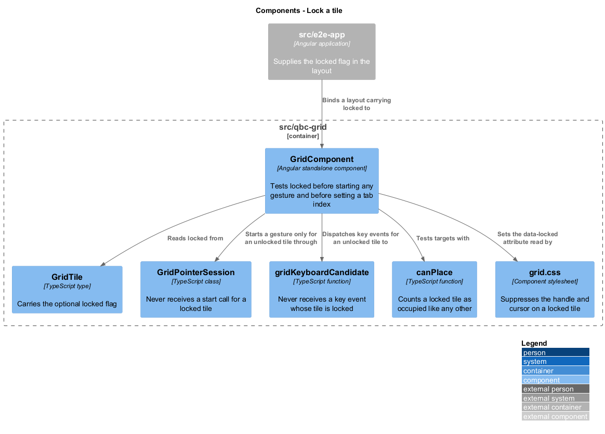
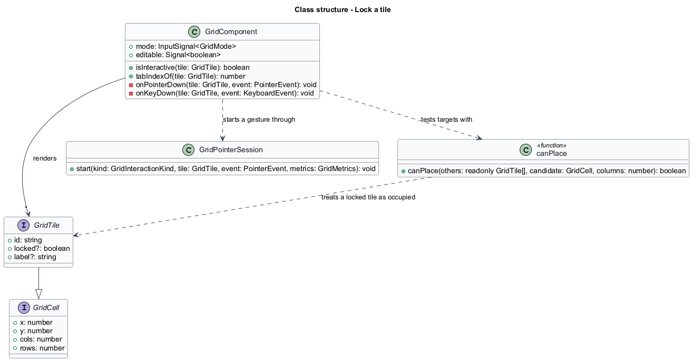
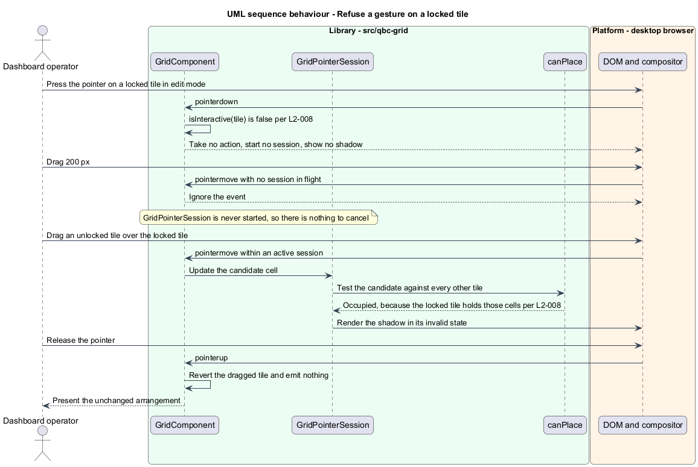
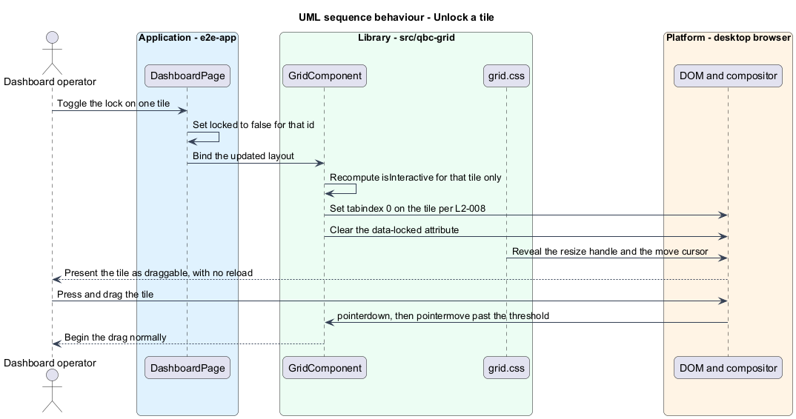

# Lock a tile

## Overview

Some tiles on an operator dashboard should not move. A master timeline, an alarm banner, a
mission clock — an operator rearranging the tiles around them expects them to stay where
they are, and expects not to drag one by accident while reaching for a neighbour.

*Locking* is that guarantee, applied to one tile. A tile with `locked` of `true` cannot be
moved or resized even while the grid is in `edit` mode, and it presents no affordance
suggesting otherwise: no move cursor, no resize handle, no place in the tab order.

Locking is per tile, not per grid, which is what distinguishes it from `live` mode. `live`
freezes the whole arrangement; a lock freezes one tile while every other tile stays fully
editable. That is the reading of "lock mode" the requirements adopt, and it matches where
comparable libraries put the same idea.

A locked tile is still part of the layout in every other respect. It occupies its cells,
it counts as occupied when another tile is dragged across it, and it is emitted in the
layout with its `locked` flag intact. Locking withdraws interaction, not existence.

The lock is a data property rather than component state, so it round-trips with the layout
and survives a save and restore. Clearing it takes effect immediately: the tile becomes
draggable and focusable on the next render, with no reload.

That last guarantee is about a transition rather than a state, so proving it needs a tile
that changes. The demonstration page carries a lock toggle inside each tile's projected
content, beside the remove control and for the same reason — the grid renders no chrome of
its own — and the [testing seam](../../README.md#the-testing-seam) names its hook.

## Description

Locking touches one field and three decision points, all of which read that field rather
than caching anything.

- **`GridTile.locked`** — optional boolean on the tile record. Absent means unlocked, so an
  existing layout gains nothing to migrate.
- **`GridComponent.isInteractive(tile)`** — the single predicate the rest of the feature
  consults: true when the grid is in `edit` mode and the tile is not locked. Having one
  predicate rather than a repeated condition is what keeps the pointer path, the keyboard
  path, and the tab order from drifting apart.
- **`GridComponent.onPointerDown`** — returns without starting a session when
  `isInteractive` is false. `GridPointerSession` is never started for a locked tile, so
  there is no gesture to cancel and no state to unwind.
- **`GridComponent.onKeyDown`** — dispatches to `gridKeyboardCandidate` only when
  `isInteractive` is true. A locked tile is not focusable in the first place, so this is a
  second barrier rather than the only one.
- **`GridComponent.tabIndexOf`** — returns `-1` for a locked tile, keeping it out of the
  tab order while leaving it readable.
- **`grid.css`** — a `data-locked` attribute on the tile element suppresses the move cursor
  and hides the resize handle. Suppressing the affordance in CSS keeps the rule beside the
  appearance it governs.
- **`canPlace`** — treats a locked tile exactly like any other occupant. No special case is
  needed: a drag over a locked tile is refused by the same overlap test that refuses a drag
  over an unlocked one.

## Requirements

The feature realizes the following level-2 (L2) requirement. It refines a level-1 (L1)
requirement, cited by identifier.

| L2 ID | Refines (L1) | Requirement |
|-------|--------------|-------------|
| `L2-008` | `L1-003` | The grid shall exclude a tile with `locked` of `true` from every pointer and keyboard interaction while in `edit` mode, and shall present no interaction affordance on it. |

## Diagrams

The system context and container views are shared across every feature and are held at
the [tree root](../../README.md#where-the-c4-levels-live).

### Components

`GridComponent` reads `locked` at three points — the pointer path, the keyboard path, and
the tab order — and the stylesheet withdraws the visible affordances. `canPlace` needs no
knowledge of locking at all.

### Class structure

`locked` is a field on the tile record, so it round-trips with the layout.
`GridComponent.isInteractive` is the one predicate that reads it.

### Behaviour — refuse a gesture on a locked tile

A press on a locked tile starts no session. A neighbouring tile dragged across it is
refused by the ordinary overlap test and reverts on release.

### Behaviour — unlock a tile

Clearing the flag restores the tab index, the cursor, and the handle on the next render.

