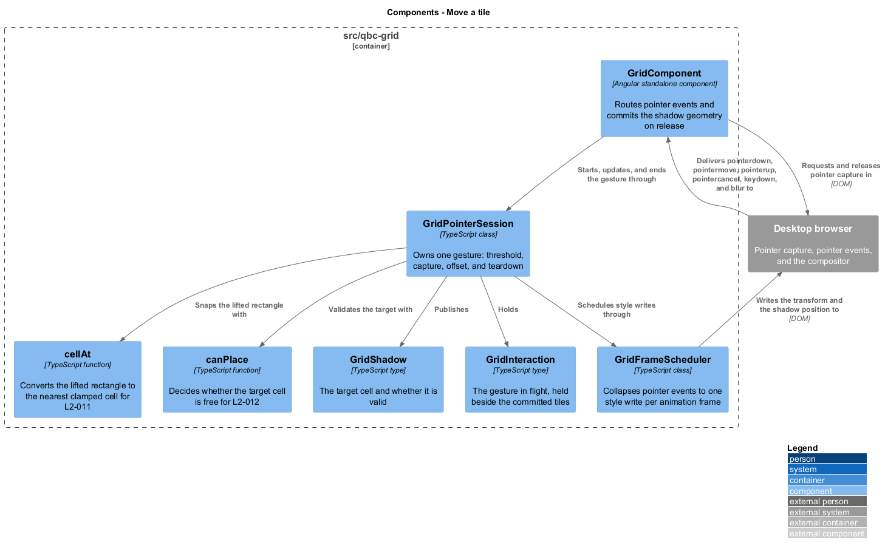
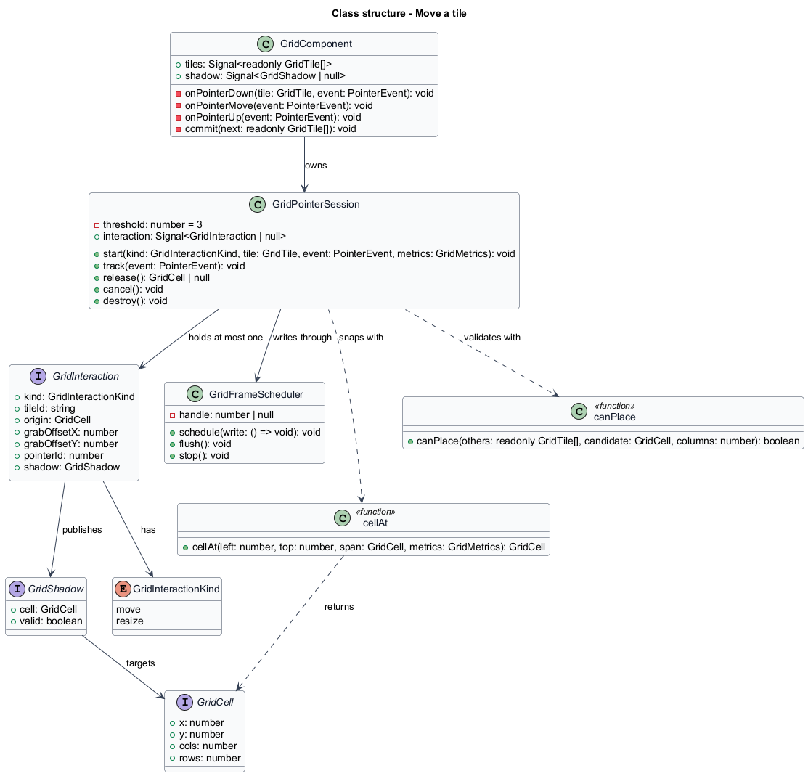
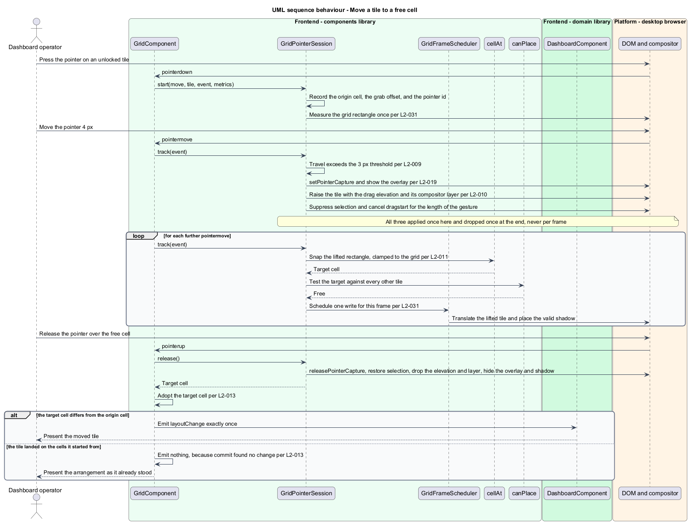
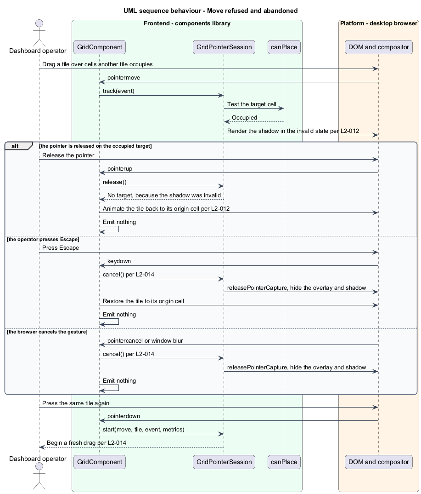

# Move a tile

## Overview

Dragging a tile to a new position is the central gesture of the library. Everything else
exists to make this one predictable.

Two things move during a drag, and they move differently. The **lifted tile** follows the
pointer in pixels, continuously, so the drag feels attached to the hand. The **shadow** —
the rectangle marking where the tile would land — snaps to whole cells, so the operator
sees the grid's answer rather than the pointer's position. Separating them is what lets
the gesture be both smooth and exact: pixels for the hand, cells for the result.

The shadow is also the whole of the feedback. It shows a valid target in the accent
colour and an invalid one in the danger colour, and what it shows before release is
exactly what happens on release. There is no push, no swap, and no reflow: the grid never
rearranges other tiles to make room. A drop onto occupied cells is refused and the tile
animates home.

Refusing rather than resolving is a deliberate trade. A push-and-float engine can find a
home for any drop, at the cost of moving tiles the operator did not touch and producing
results nobody can predict from the screen. Refusal keeps the rule small enough to hold in
the head: a tile lands where it fits.

A drag is also always escapable. `Escape`, a browser-issued `pointercancel`, and the
window losing focus each abandon the gesture and restore the tile. An abandoned drag
leaves nothing behind, so the same tile can be dragged again immediately.

## Description

The gesture is owned by one collaborator rather than by the component, which keeps
`GridComponent` responsible for state and rendering and `GridPointerSession` responsible
for recognizing the gesture.

- **`GridPointerSession`** — holds at most one `GridInteraction`. `start` records the
  origin cell, the offset between the pointer and the tile's top-left corner, and the
  pointer id, and measures the grid rectangle once. `track` applies the threshold, snaps
  the target, and validates it. `release` returns the target cell, or `null` when the
  shadow was invalid. `cancel` discards the gesture. The grab offset is what keeps the
  tile from jumping to centre itself under the cursor on the first move.
- **`GridInteraction`** — the gesture as a value: `kind`, `tileId`, `origin`,
  `grabOffsetX`, `grabOffsetY`, `pointerId`, and the current `GridShadow`. Holding the
  gesture beside the committed tile list, rather than mutating that list, is what makes
  reverting free — the committed tiles were never touched.
- **`GridShadow`** — `{ cell, valid }`. One value drives both the shadow's position and its
  colour, so the picture and the outcome cannot disagree.
- **`GridFrameScheduler`** — collapses any number of pointer events in one animation frame
  into a single style write, described in
  [`hold-the-frame-budget`](../../library-delivery/hold-the-frame-budget/).
- **`cellAt`** — pure function converting the lifted tile's top-left pixel position into
  the nearest cell, clamping `x` into `[0, columns - cols]` and `y` to at least 0. Clamping
  inside the snap is why dragging far past an edge parks the shadow at the edge instead of
  invalidating it.
- **`canPlace`** — the same overlap test used by placement and by the keyboard commands,
  so all three agree on what "free" means.

The threshold is 3 px. Below it there is no drag at all, and the pointer sequence remains
an ordinary click, which is what lets a button inside a tile stay clickable in `edit` mode.
Pointer capture is requested only once the threshold is crossed, for the same reason.

`GridComponent` listens for `pointerdown` on a tile, and for `pointermove`, `pointerup`,
`pointercancel`, `keydown`, and window `blur` while a session is active. On a valid
release it routes the new geometry through the private `commit` method, so a move emits
exactly once like every other change.

## Requirements

The feature realizes the following level-2 (L2) requirements. Each L2 requirement
refines a level-1 (L1) requirement, cited by identifier.

| L2 ID | Refines (L1) | Requirement |
|-------|--------------|-------------|
| `L2-009` | `L1-004` | The grid shall begin a drag only after the pointer has travelled 3 px from the press point, and shall not suppress interaction with projected content below that threshold. |
| `L2-010` | `L1-004` | While a drag is in progress the grid shall translate the dragged tile with the pointer in pixels and shall paint it above every other tile with the drag elevation. |
| `L2-011` | `L1-004` | While a drag is in progress the grid shall draw a shadow at the cell nearest the dragged tile top-left corner, with `x` clamped to `[0, columns - cols]` and `y` clamped to at least 0. |
| `L2-012` | `L1-004` | The grid shall render the shadow in its invalid state when the target geometry overlaps an occupied cell, and shall revert the tile when the pointer is released on an invalid target. |
| `L2-013` | `L1-004` | The grid shall adopt the shadow geometry when the pointer is released on a valid target, hide the shadow and the overlay, and emit the complete layout exactly once. |
| `L2-014` | `L1-004` | The grid shall revert a drag and release pointer capture on `Escape`, on `pointercancel`, and when the window loses focus. |

## Diagrams

The system context and container views are shared across every feature and are held at
the [tree root](../../README.md#where-the-c4-levels-live).

### Components

Pointer events reach `GridComponent`, which delegates the gesture to
`GridPointerSession`. The session snaps with `cellAt`, validates with `canPlace`, and
writes through `GridFrameScheduler`.

### Class structure

`GridInteraction` is a value held beside the committed tiles, carrying the origin cell and
the grab offset. `GridShadow` pairs the target cell with its validity, so one value drives
both position and colour.

### Behaviour — move a tile to a free cell

The threshold gates the gesture, capture follows it, and each frame snaps, validates, and
writes once. Release adopts the shadow and emits the layout.

### Behaviour — move refused and abandoned

An occupied target renders the shadow invalid. Release, `Escape`, `pointercancel`, and a
window blur all end in the same state: the tile at its origin cell and nothing emitted.

