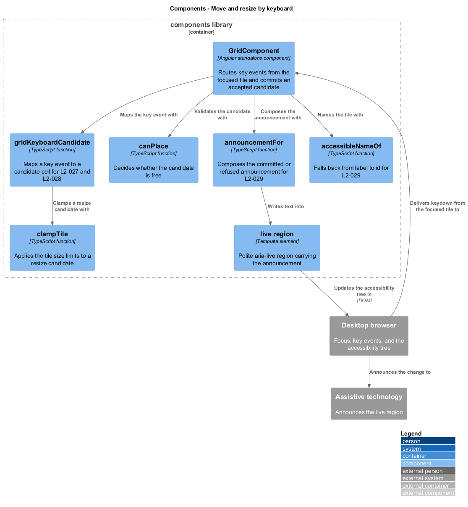
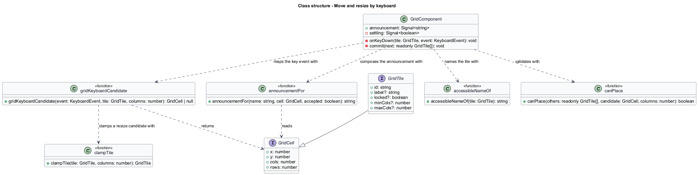
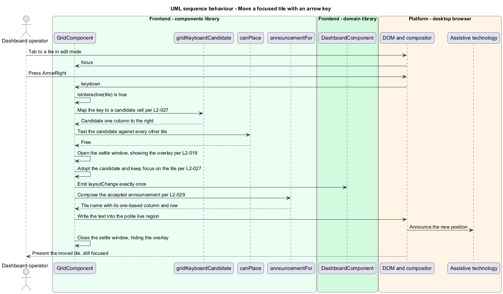
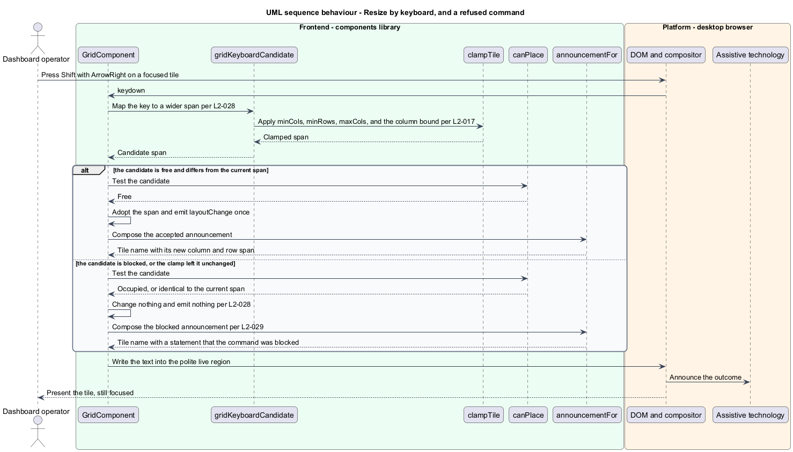

# Move and resize by keyboard

## Overview

An operator dashboard is a workplace, and a grid that can only be arranged with a mouse
excludes anyone who does not use one. Every move and every resize the pointer can perform
is therefore available from the keyboard, on the same rules and with the same outcomes.

The command set is four keys and one modifier. With an unlocked tile focused in `edit`
mode, an arrow key moves the tile one cell in that direction, and `Shift` with an arrow
changes the span by one column or one row. There is no separate grab-and-drop state to
enter and leave: each key press is a complete, committed command. A modal keyboard drag
would need an entry key, an exit key, a cancel key, and a way to tell the operator which
state they are in — all to reproduce what one arrow press already does.

Because each press is a whole command, `Escape` has nothing to cancel here. The way to
undo a keyboard move is the opposite arrow, which needs no explanation.

Refusal follows the pointer's rules exactly. A command that would take the tile outside
the grid, past a declared size limit, or onto cells another tile occupies is refused: the
tile does not move, nothing is emitted, and the operator is told. Silently absorbing the
key press would leave a screen-reader user pressing an arrow with no way to know the tile
had stopped.

Announcement is what makes refusal legible. A polite live region reports each committed
command with the tile's name and its new one-based column and row, and reports each refused
command as blocked. One-based numbers are used because "column 5" is what an operator
counts, while the stored geometry is zero-based.

## Description

The keyboard path reuses every rule the pointer path uses, and adds naming and
announcement.

- **`GridComponent.onKeyDown(tile, event)`** — bound on each tile. It returns immediately
  unless `isInteractive(tile)` is true, so a locked tile and `live` mode are both handled
  by the predicate already described in [`lock-a-tile`](../lock-a-tile/). It calls
  `preventDefault` only for a key it consumes, leaving `Tab` and every other key to the
  browser.
- **`gridKeyboardCandidate(event, tile, columns)`** — pure function mapping a key event to a
  candidate `GridCell`, or `null` for a key the grid does not consume. An unmodified arrow
  shifts `x` or `y` by one; `Shift` with a horizontal arrow changes `cols` and with a
  vertical arrow changes `rows`. A resize candidate passes through `clampTile`, so
  `minCols`, `minRows`, `maxCols`, and the grid's column bound apply exactly as they do to a
  pointer resize.
- **`canPlace`** — the same overlap and bounds test the drag shadow uses. A candidate that
  fails it is refused.
- **`accessibleNameOf(tile)`** — returns the tile's `label` when the host supplied one, and
  otherwise derives a name from the `id`. Every tile therefore has a non-empty accessible
  name, and a host that supplies none still gets a usable announcement rather than an
  unlabelled control.
- **`announcementFor(name, cell, accepted)`** — composes the live region text: the tile
  name with its one-based column and row for a committed move, the new span for a committed
  resize, and a statement that the command was blocked for a refusal.
- **`GridComponent.announcement`** — signal bound into a polite `aria-live` region in the
  grid's template. Writing text into an existing region, rather than inserting one, is what
  makes the announcement reliable.
- **`GridComponent.settling`** — the window during which the overlay stays visible after a
  keyboard command, lasting `--qbc-duration-settle`, the same token the revert animation
  uses. A keyboard command has no gesture duration of its own, so without the window
  [`reveal-the-grid`](../reveal-the-grid/) would flash the overlay for a single frame or
  not show it at all. A second command while the window is open extends it rather than
  opening another, so holding an arrow key reveals the grid once and hides it once.

Focus stays on the tile across a committed command. The tile element is not re-created — it
is repositioned through its custom properties — so focus survives without being restored,
and an operator can press an arrow four times to move four cells.

An accepted command routes through the same private `commit` method as every other change,
so a keyboard move emits once, exactly like a drag.

## Requirements

The feature realizes the following level-2 (L2) requirements. Each L2 requirement
refines a level-1 (L1) requirement, cited by identifier.

| L2 ID | Refines (L1) | Requirement |
|-------|--------------|-------------|
| `L2-027` | `L1-010` | With an unlocked tile focused in `edit` mode, each arrow key shall move the tile one cell in that direction, shall refuse a move that leaves the grid or overlaps another tile, and shall retain focus on the tile. |
| `L2-028` | `L1-010` | With an unlocked tile focused in `edit` mode, `Shift` with a horizontal arrow shall change `cols` by one and `Shift` with a vertical arrow shall change `rows` by one, subject to the size limits and overlap rules of a pointer resize. |
| `L2-029` | `L1-010` | The grid shall give every tile a non-empty accessible name and shall announce each committed or refused keyboard move or resize through a polite live region. |

## Diagrams

The system context and container views are shared across every feature and are held at
the [tree root](../../README.md#where-the-c4-levels-live).

### Components

The key event is mapped to a candidate, clamped where it is a resize, validated by the same
`canPlace` the pointer path uses, and reported through the live region.

### Class structure

`gridKeyboardCandidate` produces a candidate cell; `clampTile` and `canPlace` decide
whether it stands. `accessibleNameOf` and `announcementFor` turn the outcome into text.

### Behaviour — move a focused tile with an arrow key

One press is one complete command: map, validate, commit, emit, announce, and keep focus.

### Behaviour — resize by keyboard, and a refused command

A resize candidate is clamped before it is validated. A blocked or clamped-to-unchanged
command alters nothing, emits nothing, and is announced as blocked.

