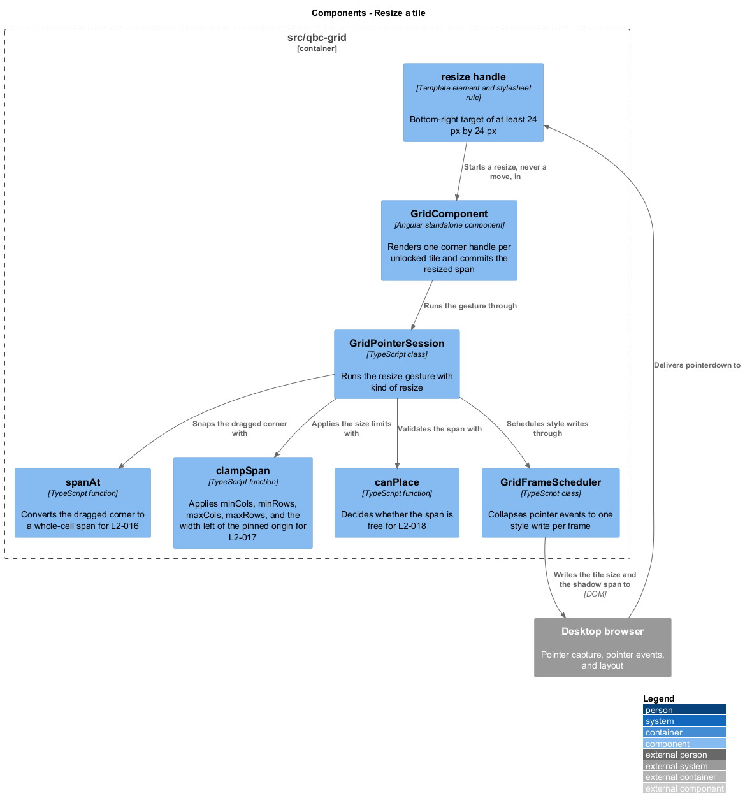
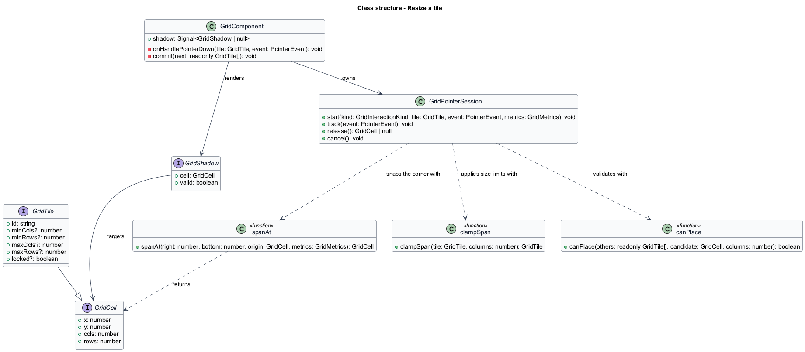
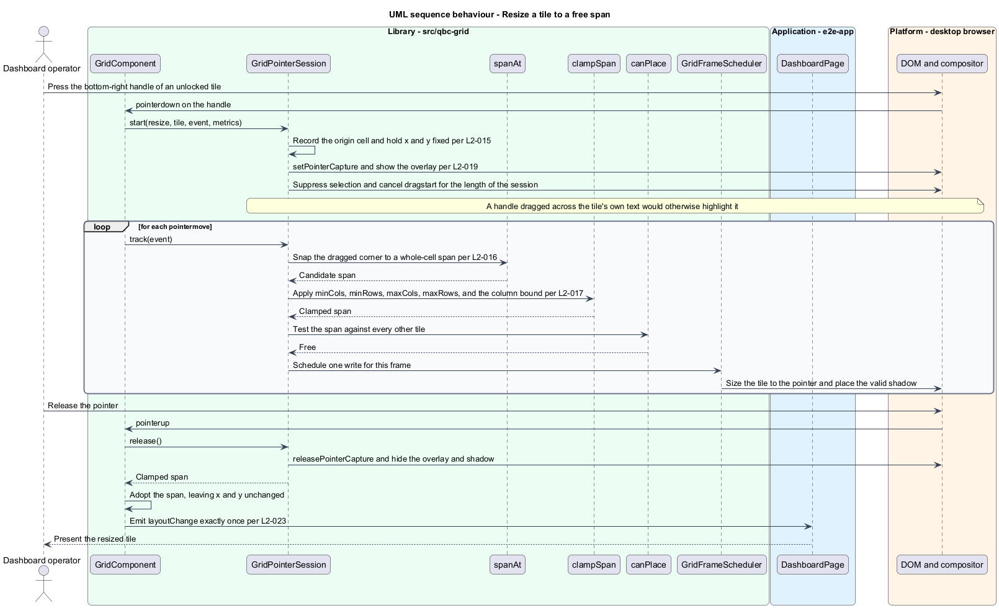
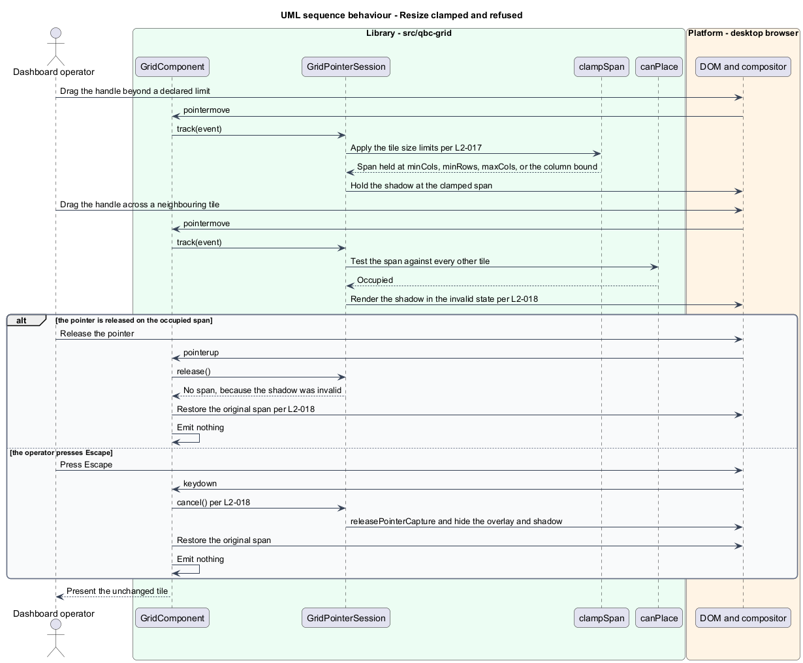

# Resize a tile

## Overview

A tile's span is as much a part of an arrangement as its position. An operator widens a
plot to read it and shrinks a status pill to make room. This feature covers the pointer
gesture that changes a tile's `cols` and `rows` while leaving its `x` and `y` alone.

The grid offers **one** resize handle, at the bottom-right corner. Edge handles and a
second corner were considered and left out: each additional handle multiplies the states
the gesture can be in, and a single corner that grows a tile right and down is the gesture
every comparable library trains its users on. The handle's hit area is at least 24 px
square, because a 4 px visual corner is not a 4 px target.

Resize reuses the move gesture wholesale. The same `GridPointerSession` runs it with a
`kind` of `resize`, the same shadow shows the outcome in whole cells while the tile itself
follows the pointer in pixels, the same overlay appears, and the same `Escape` abandons
it. Only three things differ: the origin corner is pinned, the snap converts a corner
rather than a top-left position, and the candidate passes through the tile's declared size
limits before it is validated.

Those limits are the tile's own. `minCols` and `minRows` default to 1 and stop a tile from
collapsing to nothing; `maxCols` and `maxRows` are optional, and `maxCols` is additionally
held to the grid's column count, so a tile declaring `maxCols` of 20 in a 12-column grid
reaches 12 and no further. Clamping never invalidates the shadow — an over-dragged
handle parks at the limit rather than turning red, which is what makes the boundary feel
like a wall rather than an error.

Overlap is different from a limit. A span that would cover a neighbour is refused, shown
in the invalid colour, and reverted on release, exactly as a move onto occupied cells is.
The grid does not shrink or displace the neighbour to make room.

## Description

The feature adds one template element and one pure function to the machinery already
described in [`move-a-tile`](../move-a-tile/).

- **The resize handle** — an element rendered inside each unlocked tile in `edit` mode, at
  the bottom-right corner, inset by `--qbc-space-1`. Its hit area is the larger of
  `--qbc-size-handle` and the 24 px floor this requirement sets, so a consumer restyling the
  grid can enlarge the target but cannot shrink it below what `L2-015` demands. The hit area
  may extend beyond the handle's visual bounds, which is what lets a small corner grip stay
  easy to catch. `pointerdown` on the handle stops propagation, so the press starts a resize
  and never a move.
- **`GridComponent.onHandlePointerDown`** — starts `GridPointerSession` with a `kind` of
  `resize`. The session records the origin cell and holds `x` and `y` fixed for the
  duration.
- **`spanAt`** — pure function converting the dragged corner's pixel position into a
  whole-cell span relative to the pinned origin, returning at least one column and one
  row.
- **`clampSpan`** — applies `minCols`, `minRows`, `maxCols`, `maxRows`, and the width left
  of the tile's own origin, which is `columns - x`. It changes `cols` and `rows` and leaves
  `x` and `y` alone.

  It is a sibling of `clampTile` rather than the same function, and the difference is the
  origin. `clampTile` repairs a record arriving from storage, where an oversized span is
  corrected by narrowing the tile and, where that is not enough, by moving it back inside
  the grid. A resize has no such freedom: the origin corner is the one the operator is not
  dragging, and moving it turns a resize into a move. A tile at column 9 of twelve grown
  without limit stops at 3 columns, and `clampTile` would instead widen it to 12 and slide
  it to column 0. The two share their numeric rules — the same minimums, the same
  maximums, the same flooring — and differ in the one rule that cannot be shared.
- **`canPlace`** — the same overlap test used everywhere else, applied to the clamped span.
- **`GridShadow`** — carries the clamped span and its validity, so the rectangle on screen
  is the geometry that would be committed.

On release with a valid span, `GridComponent` adopts `cols` and `rows` and routes the
change through the private `commit` method, emitting once. On an invalid span, on
`Escape`, on `pointercancel`, and on a window blur, the session is discarded and the tile
returns to its original span with nothing emitted.

## Requirements

The feature realizes the following level-2 (L2) requirements. Each L2 requirement
refines a level-1 (L1) requirement, cited by identifier.

| L2 ID | Refines (L1) | Requirement |
|-------|--------------|-------------|
| `L2-015` | `L1-005` | The grid shall expose exactly one resize handle per unlocked tile in `edit` mode, at the bottom-right corner, with a hit area of at least 24 px by 24 px, and a press on that handle shall start a resize and shall not start a move. |
| `L2-016` | `L1-005` | While a resize is in progress the grid shall size the tile to the pointer in pixels and shall draw a shadow at the whole-cell span the tile would take on release. |
| `L2-017` | `L1-005` | The grid shall clamp every resize to the tile `minCols`, `minRows`, `maxCols`, and `maxRows`, shall default `minCols` and `minRows` to 1, and shall clamp `maxCols` to `columns`. |
| `L2-018` | `L1-005` | The grid shall render the resize shadow invalid when the target span overlaps an occupied cell, and shall revert the tile size on release or on `Escape`. |

## Diagrams

The system context and container views are shared across every feature and are held at
the [tree root](../../README.md#where-the-c4-levels-live).

### Components

The handle starts the same session the move gesture uses, with `spanAt` in place of
`cellAt` and `clampSpan` applied before validation.

### Class structure

`spanAt` converts the dragged corner; `clampSpan` enforces the tile's declared limits;
`canPlace` decides validity. `GridShadow` carries the clamped span so the picture matches
the outcome.

### Behaviour — resize a tile to a free span

The origin is pinned, each frame snaps and clamps and validates once, and release adopts
the span while leaving `x` and `y` unchanged.

### Behaviour — resize clamped and refused

A limit parks the shadow rather than invalidating it. An overlap invalidates it, and
release or `Escape` restores the original span.

