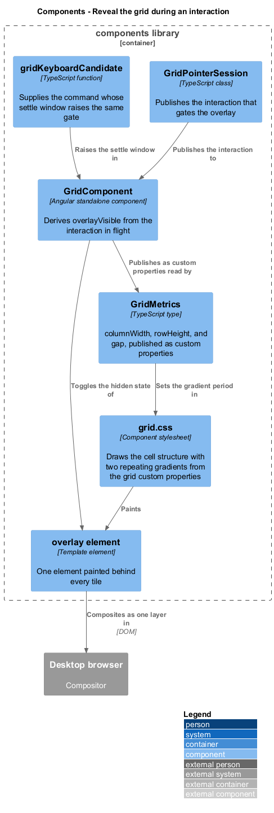
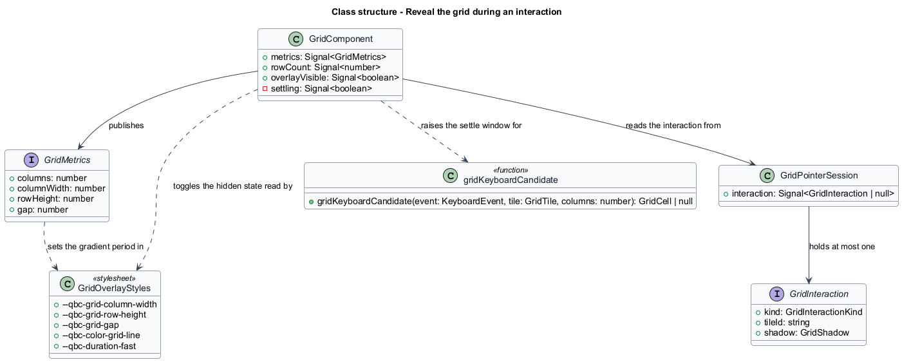
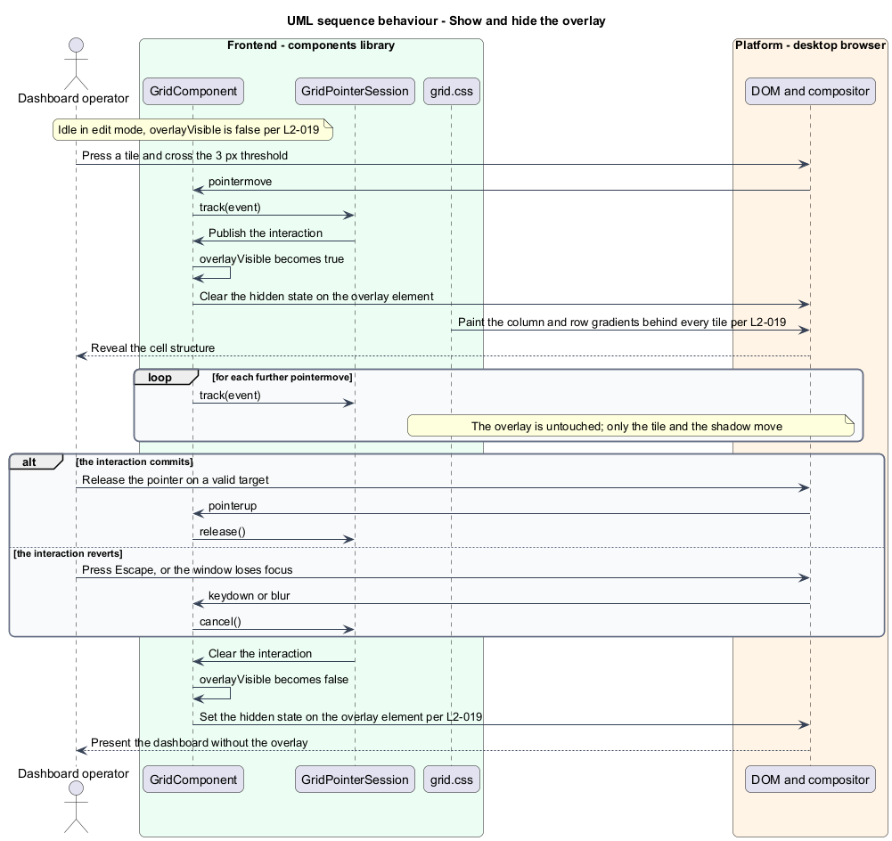

# Reveal the grid during an interaction

## Overview

A tile snaps to cells the operator cannot see. During a drag that is a problem: the shadow
says where the tile will land, but not what the landing choices are. Painting the cell
structure for the duration of the gesture answers that, and hiding it the rest of the time
keeps a watching dashboard free of scaffolding.

The *overlay* is the cell structure of the whole grid, drawn behind every tile. It appears
when a move or resize begins and disappears when the interaction ends, whether that
interaction committed or reverted. It is not a mode, not a toggle, and not visible while
the grid is idle in `edit` mode.

Two properties keep it from getting in the way. It is painted **behind** the tiles, so a
tile is never dimmed or obscured by it. And it is inert to the pointer, so a press that
lands on an overlay line reaches the tile or the grid beneath it. An overlay that
intercepted events would break a drag the moment the pointer crossed a gutter.

The overlay is drawn with two repeating gradients rather than with an element per cell. A
12-column grid 40 rows deep has 480 cells; rendering them as elements would put 480 nodes
into the document at the exact moment the frame budget matters most. Two gradients cost
one element and composite as a single layer.

## Description

The overlay is one element, one derived signal, and a stylesheet rule.

- **The overlay element** — a single element in `GridComponent`'s template, absolutely
  positioned to cover the grid host, with `pointer-events: none` and a stacking order below
  every tile. Its visibility is toggled through the `hidden` property rather than by adding
  and removing it, so showing it is an attribute write rather than a DOM insertion.
- **`GridComponent.overlayVisible`** — computed signal, true when
  `GridPointerSession.interaction()` is not `null`, or while the settle window of a
  keyboard command is open. One signal covers the pointer path and the keyboard path, so
  the overlay cannot appear for one and not the other.
- **`GridComponent.settling`** — the window a keyboard command holds the overlay open,
  lasting `--qbc-duration-settle` and described in
  [`move-and-resize-by-keyboard`](../move-and-resize-by-keyboard/). A keyboard move has no
  gesture duration of its own, so without the window the overlay would flash.
- **`grid.css`** — draws the structure with two `repeating-linear-gradient` layers. The
  horizontal layer has a period of `columnWidth + gap` and paints a `gap`-wide line in
  `--qbc-color-grid-line`; the vertical layer has a period of `rowHeight + gap`. Both
  periods come from the custom properties `GridComponent` already publishes for tile
  positioning, so the overlay cannot fall out of step with the cells it describes.
- **Fade** — the overlay's opacity transitions over `--qbc-duration-fast`, so the reveal
  reads as part of the gesture rather than as a flicker.

`GridComponent` writes `--qbc-grid-column-width`, `--qbc-grid-row-height`, and
`--qbc-grid-gap` once per metrics change. The overlay reads them and needs no update of its
own during a gesture, which is why no overlay work happens inside the drag loop.

## Requirements

The feature realizes the following level-2 (L2) requirement. It refines a level-1 (L1)
requirement, cited by identifier.

| L2 ID | Refines (L1) | Requirement |
|-------|--------------|-------------|
| `L2-019` | `L1-006` | The grid shall show the cell overlay for the duration of a move or resize, shall remove it whether the interaction commits or reverts, shall paint it behind every tile, and shall not let it intercept pointer events. |

## Diagrams

The system context and container views are shared across every feature and are held at
the [tree root](../../README.md#where-the-c4-levels-live).

### Components

The interaction in flight gates one derived signal, which toggles one element. The cell
structure itself comes from the metrics custom properties the grid already publishes.

### Class structure

`overlayVisible` is derived from the pointer session and the keyboard settle window
together, so both interaction paths reveal the grid identically.

### Behaviour — show and hide the overlay

The overlay appears when the gesture starts, stays untouched for the whole of it, and is
removed on both the committing and the reverting exit.

