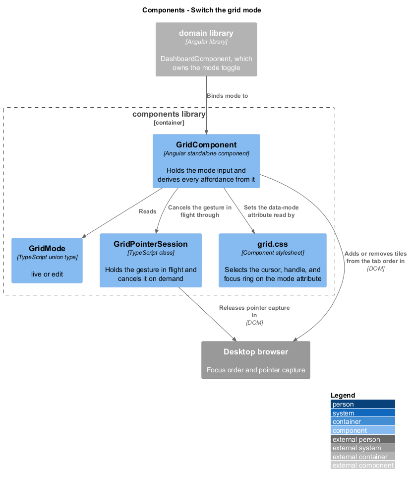
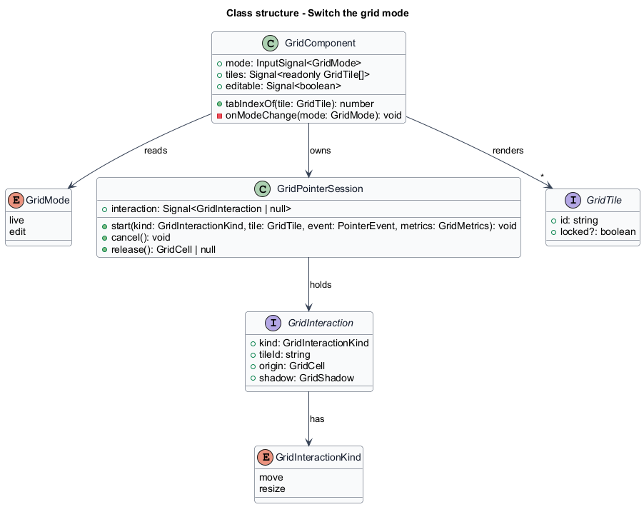
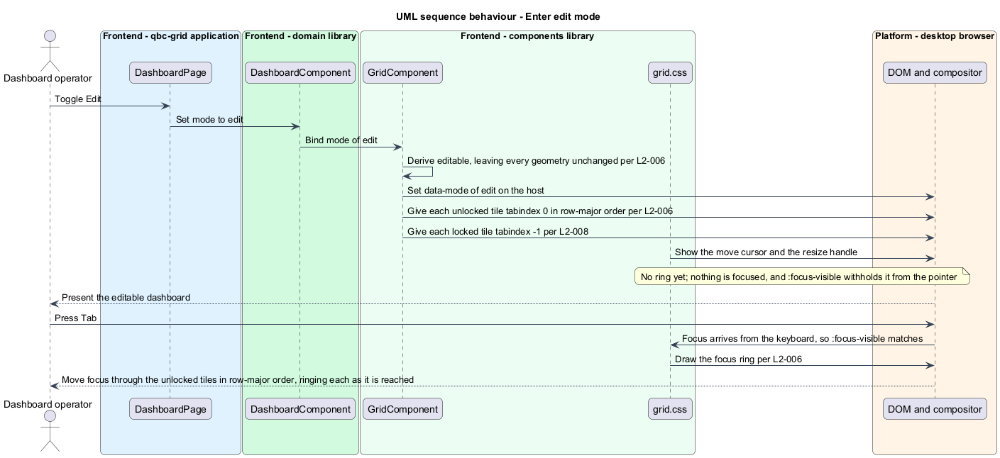
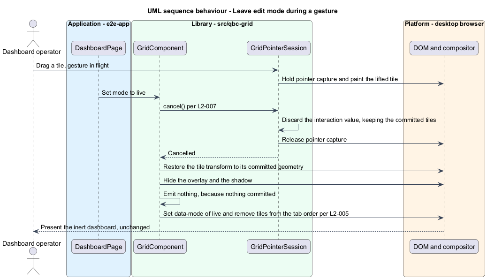

# Switch the grid mode

## Overview

An operator dashboard spends almost all of its life being watched, not rearranged. The
grid therefore has two modes, and the default is the watching one.

- **live** — the arrangement is inert. No tile is focusable, no cursor suggests movement,
  no resize handle exists, and no pointer or keyboard gesture changes a geometry.
- **edit** — unlocked tiles can be moved and resized, and each carries the affordances
  that say so.

Two modes rather than three is a deliberate reading of the source prompt, which named
"lock mode, edit or live mode". A third grid-level mode that forbids interaction would be
indistinguishable from `live` at every observable point. What the prompt calls locking is
therefore a property of a tile, covered in [`lock-a-tile`](../lock-a-tile/), where it does
something `live` cannot: freeze one tile while the rest stay editable.

Mode governs affordance, never geometry. Switching from `live` to `edit` and back changes
what the operator can do and what the tiles look like; it moves nothing. That guarantee is
what lets a host toggle the mode freely without risking the saved arrangement.

The one case where mode changes state is a gesture in flight. Setting the mode to `live`
during a move or a resize reverts that gesture and releases pointer capture, because the
operator can no longer see or steer it. Reverting rather than committing is the safe
reading: an interrupted gesture is not a decision.

## Description

Mode is a single input on `GridComponent`, and everything else derives from it.

- **`GridMode`** — the union type `'live' | 'edit'`, in its own file. `live` is the
  default, so a host that never sets the input gets an inert grid.
- **`GridComponent.mode`** — the signal input. `GridComponent.editable` is the computed
  signal `mode() === 'edit'`, and it is the only condition the rest of the component
  tests.
- **`GridComponent.tabIndexOf(tile)`** — returns `0` for an unlocked tile in `edit` mode
  and `-1` otherwise. The template iterates `GridComponent.orderedTiles`, which sorts by
  `y`, then `x`, then `id`, so document order already matches reading order and the tab
  order follows it without a `tabindex` above zero. The supplied layout carries no such
  guarantee, which is why the sort exists rather than being assumed, and why `L2-006` fixes a
  supplied order that differs from the row-major one rather than leaving the two to coincide.
- **The demonstration page's controls** — withheld in `live` mode. The grid withdraws its
  own tiles from the tab order, and reaches no further; the add, remove, and lock controls
  belong to projected content and would stay tabbable on an inert dashboard if the page kept
  rendering them. A watching operator tabbing into a button that rearranges the dashboard is
  the opposite of what `live` means, so the page renders those controls only in `edit`. That
  is a host decision, and it is the host that has to make it.
- **`grid.css`** — the stylesheet keys the move cursor, the resize handle's visibility,
  and the focus ring off a `data-mode` attribute written on the host. Presenting the
  affordances in CSS rather than in a template branch means the mode switch is one
  attribute write, not a re-render of every tile.

  The focus ring hangs on `:focus-visible`, not `:focus`. A tile is focusable so that
  [`move-and-resize-by-keyboard`](../move-and-resize-by-keyboard/) has somewhere to send
  its commands, and it is also the surface a pointer presses to start a drag. Under
  `:focus` every drag would leave a ring behind on the tile it just dropped, on a dashboard
  whose whole point is being looked at. `:focus-visible` shows the ring to the keyboard and
  withholds it from the pointer, which is the behaviour `L2-006` describes and the reason
  the distinction is worth naming.
- **`GridPointerSession`** — holds the gesture in flight as a `GridInteraction` value and
  exposes `cancel()`. Because the gesture is a value beside the committed tile list rather
  than a mutation of it, cancelling is discarding that value; no undo is needed.

`GridComponent` watches the mode input and calls `GridPointerSession.cancel()` when the
mode leaves `edit`. `cancel()` releases pointer capture, clears the interaction, and hides
the overlay and shadow. No layout is emitted, since nothing was committed.

## Requirements

The feature realizes the following level-2 (L2) requirements. Each L2 requirement
refines a level-1 (L1) requirement, cited by identifier.

| L2 ID | Refines (L1) | Requirement |
|-------|--------------|-------------|
| `L2-005` | `L1-002` | In `live` mode the grid shall present no resize handle, no move cursor, and no focusable tile, and shall not change any tile geometry in response to a pointer or keyboard gesture. |
| `L2-006` | `L1-002` | In `edit` mode the grid shall show a move cursor and a resize handle on every unlocked tile and shall place unlocked tiles in the tab order in row-major layout order, and shall show a focus indicator on a tile focused from the keyboard and not on one pressed with the pointer. |
| `L2-007` | `L1-002` | The grid shall revert an interaction in progress when the mode changes away from `edit`. |

## Diagrams

The system context and container views are shared across every feature and are held at
the [tree root](../../README.md#where-the-c4-levels-live).

### Components

The mode input drives one derived signal, one attribute on the host, and one call into
`GridPointerSession`. The stylesheet does the rest.

### Class structure

`GridComponent` owns `GridPointerSession`, which holds at most one `GridInteraction`. The
interaction is a value, which is what makes cancellation trivial.

### Behaviour — enter edit mode

Entering `edit` writes one attribute, sets the tab index on each tile according to its
lock state, and changes no geometry.

### Behaviour — leave edit mode during a gesture

Leaving `edit` mid-gesture cancels the session, releases pointer capture, restores the
committed geometry, and emits nothing.

